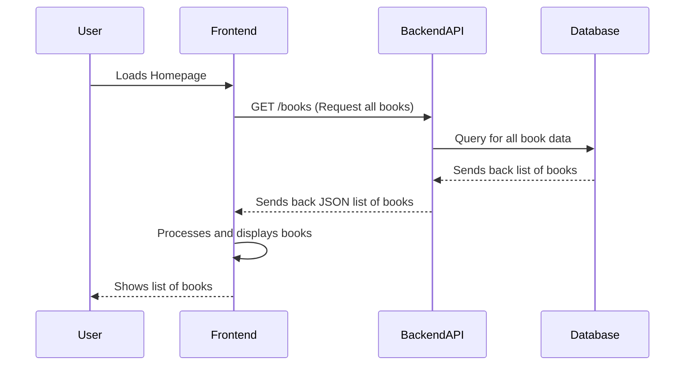
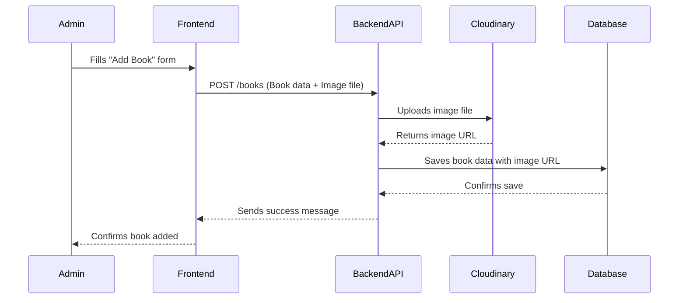

# Chapter 1: Book Data Model & API

Welcome to the exciting world of `book-world`! In this first chapter, we're going to explore the very heart of our application: how we define what a "book" is and how we talk to our system to manage all the books in our digital library.

Think of our `book-world` application like a big, modern library. Every library needs a way to keep track of its books, right? They need to know the title, who wrote it, what kind of story it is, and maybe even a picture of the cover. This is exactly what the "Book Data Model" helps us do. It's like creating a detailed index card for every book in our library.

Once we have these "index cards," we need a way to actually _use_ them. How do we add new books to the library? How do we find a specific book? How do we update its details if something changes? This is where the "API" comes in. The API (which stands for Application Programming Interface) is like the set of rules and tools the librarians use to manage the catalog. It lets us add new books, look up existing ones, change their details, or even remove them from the collection.

## What is a Book "Data Model"?

In `book-world`, a "Book Data Model" is simply the blueprint for what information we store about each book. Just like a physical book has a title, author, and genre, our digital books have these details too.

Here's a simplified look at the kind of information our `book-world` application keeps for each book, similar to what you'd find in a library's catalog:

```javascript
// From: book-world-main/backend/models/books.js
const bookSchema = new mongoose.Schema({
  title: String, // The name of the book
  description: String, // A short summary
  author: String, // Who wrote the book
  genre: [String], // What kind of book it is (e.g., "Fiction", "Fantasy")
  year_published: Number, // When the book was released
  image_url: String, // A link to the book's cover image
  // ... other technical details like unique ID
});
```

This `bookSchema` (think of it as "book blueprint") tells our database exactly what pieces of information to expect for every single book. For example, `title` is a `String` (text), `year_published` is a `Number`, and `genre` is a list of `String`s because a book can have multiple genres! The `image_url` is especially important because it stores the web address for the book's cover picture.

## What is an "API"?

Now that we know what information we're storing, how do we get it in and out of our system? That's the API's job.

Imagine our `book-world` system has a front desk (the "Frontend," what you see in your web browser) and a back office (the "Backend," where all the data is stored and managed). The API is the polite, structured way these two parts talk to each other.

Here are the main "actions" our book API lets us perform, just like a librarian would manage a physical catalog:

- **Get Books**: Browse all books or search for specific ones. (Like browsing the library shelves)
- **Get a Single Book**: View all the details of one particular book. (Like picking up a book and reading its back)
- **Add a Book**: Introduce a brand new book to the collection. (Like adding a new book to the library's catalog)
- **Update a Book**: Change details for an existing book. (Like correcting a typo in a book's entry)
- **Delete a Book**: Remove a book from the collection entirely. (Like removing a damaged book from the library)

## Use Case: Seeing All Books on the Homepage

Let's look at a common scenario: when you open the `book-world` app, you want to see a list of all available books. How does this happen using our Book Data Model and API?

Our application's homepage needs to _ask_ the backend for the list of books. This "asking" is done through the API.

Here's a simplified look at how our frontend (what you see) asks for the book data:

```javascript
// From: book-world-main/frontend/src/hooks/useBooks.js
import axios from "axios"; // Tool to make web requests
import { useEffect, useState } from "react";

const useBooks = () => {
  const [books, setBooks] = useState([]); // Where we'll store the books
  const [isLoading, setIsLoading] = useState(false); // To know if we're waiting for data

  useEffect(() => {
    setIsLoading(true); // Start loading
    axios
      .get(`${import.meta.env.VITE_BACKEND_URL}/books`) // Ask the API for all books
      .then((response) => {
        setBooks(response.data.books); // Put the received books into our storage
      })
      .catch((err) => {
        // ... handle any errors ...
      })
      .finally(() => setIsLoading(false)); // Stop loading
  }, []); // Run this code only once when the page loads

  return { books, isLoading }; // Give back the books and loading status
};
```

This small piece of code, called a "hook," is like sending a message to the backend: "Hey, give me all the books!" When the backend sends back the list, the frontend stores it and then displays it on the homepage.

The homepage then uses a component called `BookCard` to display each book's information:

```javascript
// From: book-world-main/frontend/src/components/BookCard.jsx
import { Link } from "react-router-dom"; // For navigating to book details

const BookCard = ({ book }) => {
  // Change image URL to get a suitable size for the card
  const image = book.image_url.replace("/upload", "/upload/h_400");
  return (
    <Link to={`/books/` + book._id}>
      {" "}
      {/* Link to individual book page */}
      <div className="relative m-2 group rounded-lg">
         {/* Display the cover image */}
        <div>
          <h3>{book.title}</h3> {/* Display the title */}
          <div>{book.author}</div> {/* Display the author */}
        </div>
      </div>
    </Link>
  );
};
```

This `BookCard` receives the `book` data (title, author, image URL, etc.) and uses it to show a nice, clickable card for each book on the homepage.

## Under the Hood: How Requesting Books Works

Let's trace what happens when the frontend asks the backend for all the books:



1.  **User Loads Homepage**: You open `book-world` in your browser.
2.  **Frontend Requests Books**: The homepage (our "Frontend") automatically sends a "GET" request to our "Backend API" asking for the list of books. It's like asking the librarian, "What books do you have?"
3.  **Backend Queries Database**: The "Backend API" receives this request. It then talks to the "Database" (where all our book information is actually stored) and asks for all the book records.
4.  **Database Responds**: The "Database" finds all the book records and sends them back to the "Backend API."
5.  **Backend Sends Data to Frontend**: The "Backend API" takes this raw data and packages it nicely into a format called JSON (which is just a common way for computers to exchange information) and sends it back to the "Frontend."
6.  **Frontend Displays Books**: The "Frontend" receives the JSON data, understands it, and then uses that information (title, author, image URL, etc.) to draw all the book cards you see on the homepage.

### Backend Code for Getting Books

On the backend, there are two main parts involved in handling the `GET /books` request: the **router** and the **controller**.

1.  **The Router (`backend/router/book.js`)**: This is like the front desk of our API. It listens for incoming requests and directs them to the right "expert" (the controller function).

    ```javascript
    // From: book-world-main/backend/router/book.js
    const express = require("express");
    const bookController = require("../controller/books.js");
    const router = express.Router();

    router
      .route("/") // This means requests to "/books" (since this router is for /books)
      .get(bookController.getAllBooks); // If it's a GET request, use getAllBooks function
    // ... other methods like .post, .put, .delete
    ```

    When a `GET` request comes to `/books`, our router sends it to a function called `getAllBooks` within `bookController`.

2.  **The Controller (`backend/controller/books.js`)**: This is the "expert" that actually performs the action. For `getAllBooks`, it talks to the database.

    ```javascript
    // From: book-world-main/backend/controller/books.js
    const Book = require("../models/books"); // Our book blueprint

    module.exports.getAllBooks = async (req, res) => {
      // Check if there's a search query (like "fantasy" or "mystery")
      const { q } = req.query;
      let books;
      if (q) {
        // If there's a query, find books matching title, author, or genre
        // (Simplified for clarity)
        books = await Book.find({
          /* search logic here */
        });
      } else {
        books = await Book.find({}); // Find ALL books if no search query
      }
      res.json({
        books: books, // Send the list of books back as JSON
      });
    };
    ```

    This `getAllBooks` function uses our `Book` model (our blueprint) to ask the database to `find({})` all the books. Once it gets them, it sends them back to the frontend using `res.json()`.

## Use Case: Adding a New Book (with Image)

Now, let's consider a more complex action: an administrator wants to add a brand new book, complete with its cover image.

When an admin fills out the "Add Book" form and clicks submit, our frontend sends a `POST` request to the API.

```javascript
// From: book-world-main/frontend/src/pages/AddBook.jsx
import axios from "axios"; // For making web requests
import { useForm } from "react-hook-form"; // For managing form data

const AddBook = () => {
  const form = useForm({
    /* ... form setup ... */
  });
  const navigate = useNavigate(); // For redirecting after success
  const [isLoading, setIsLoading] = useState(false); // To show loading state

  const onSubmit = (values) => {
    setIsLoading(true); // Start loading
    let promise = axios.post(
      `${import.meta.env.VITE_BACKEND_URL}/books`, // Send to POST /books endpoint
      values, // The book data (title, author, image file, etc.)
      {
        headers: {
          "Content-Type": "multipart/form-data", // Special header for files
          Authorization: `Bearer ${localStorage.getItem("token")}`, // Admin access
        },
      }
    );

    toast.promise(promise, {
      loading: "Adding book...",
      success: (response) => {
        navigate("/books/"); // Go back to the main books page
        return response.data.message;
      },
      error: (error) => {
        // ... handle errors ...
      },
      finally: () => setIsLoading(false),
    });
  };

  return (
    // ... form structure using form.handleSubmit(onSubmit) ...
    <form onSubmit={form.handleSubmit(onSubmit)}>
      {/* Input fields for title, author, description, genre, year_published */}
      {/* File input for image */}
      <Button type="submit">Submit</Button>
    </form>
  );
};
```

This code creates a `POST` request to `/books` and includes all the book's details, _plus_ the image file. The special `Content-Type: "multipart/form-data"` header is crucial because it tells the server that we're sending a file along with other form data.

## Under the Hood: How Adding a Book Works

Adding a book involves a few more steps, especially because we're handling an image file:



1.  **Admin Fills Form**: An admin user enters book details and selects a cover image.
2.  **Frontend Sends Data**: When the admin submits the form, the "Frontend" sends a `POST` request to the "Backend API" containing all the book's text details and the image file itself.
3.  **Backend Uploads Image**: The "Backend API" first takes the image file and uploads it to an external service called "Cloudinary." Cloudinary is a specialized service for storing and managing images.
4.  **Cloudinary Returns URL**: Cloudinary processes the image and sends back a unique web address (URL) where the image is now stored.
5.  **Backend Saves Book Data**: Now, the "Backend API" has all the book's text information _and_ the `image_url` from Cloudinary. It combines these and saves the complete book record into the "Database."
6.  **Database Confirms**: The "Database" confirms that the book data has been saved.
7.  **Backend Sends Success**: The "Backend API" sends a success message back to the "Frontend."
8.  **Frontend Confirms**: The "Frontend" displays a confirmation to the admin and might redirect them to the book list.

### Backend Code for Adding Books and Image Handling

Let's dive into the backend code for this process.

1.  **The Router (`backend/router/book.js`)**:

    ```javascript
    // From: book-world-main/backend/router/book.js
    const express = require("express");
    const bookController = require("../controller/books.js");
    const upload = require("../middleware/upload.js"); // Our image upload middleware
    const { authorization } = require("../middleware/auth.js"); // For checking admin role
    const router = express.Router();

    router.route("/").post(
      authorization, // Check if user is logged in and authorized
      upload.single("image"), // Process the single image file
      bookController.createBook // Then call the createBook function
    );
    ```

    Notice the `authorization` and `upload.single("image")` lines. These are "middleware" functions that run _before_ `createBook`. `authorization` checks if the user is allowed to add a book (only admins can). `upload.single("image")` is the magic that handles the image file.

2.  **Image Upload Middleware (`backend/middleware/upload.js` and `backend/middleware/cloudinary.js`)**:
    The `upload` middleware uses a library called `multer` to handle files. In our case, `multer` is configured to work with `cloudinary` using `multer-storage-cloudinary`.

    ```javascript
    // From: book-world-main/backend/middleware/cloudinary.js
    const cloudinary = require("cloudinary").v2;
    const { CloudinaryStorage } = require("multer-storage-cloudinary");
    // ... load environment variables ...

    cloudinary.config({
      /* ... your Cloudinary API keys ... */
    });

    const cloudStorage = new CloudinaryStorage({
      cloudinary: cloudinary,
      params: {
        folder: "book-world", // Where images are stored on Cloudinary
        allowedFormats: ["png", "jpg", "jpeg"], // Allowed image types
        public_id: (req, file) => {
          // ... generate a unique name for the image ...
        },
      },
    });

    module.exports = cloudStorage; // Export this storage configuration
    ```

    This setup ensures that when an image is sent, `multer` intercepts it, sends it to Cloudinary using `cloudStorage`, and then Cloudinary stores it and gives us back a URL. This URL is then attached to the `req.file.path` property for the next step.

3.  **The Controller (`backend/controller/books.js`)**:

    ```javascript
    // From: book-world-main/backend/controller/books.js
    const Book = require("../models/books");
    const ExpressError = require("../utils/ExpressErrors");

    module.exports.createBook = async (req, res) => {
      if (req.role !== "admin") {
        // Double-check authorization (important!)
        throw new ExpressError(401, "You are not Authorized to Add Book");
      }
      const body = req.body; // Get other book data (title, author, etc.)

      if (req.file) {
        // If an image file was uploaded
        body.image_url = req.file.path; // Set the image_url to the path provided by Cloudinary
      }

      const book = new Book(body); // Create a new book object using our blueprint
      await book.save(); // Save the new book to the database

      res.json({
        book,
        message: `New Book: ${book.title} Added`, // Send success message
      });
    };
    ```

    This `createBook` function is where the book data (including the Cloudinary image URL) is finally saved into our database using `book.save()`.

## Conclusion

In this first chapter, you've learned about the fundamental building blocks of `book-world`:

- **Book Data Model**: The structured way we define and store information about each book, like its title, author, genre, and especially its `image_url` for the cover.
- **API (Application Programming Interface)**: The set of rules and tools that allows the frontend (what you see) and backend (where data is managed) to communicate and manage book data.

We explored how the system works when you view all books on the homepage and how an administrator adds a new book, including how cover images are uploaded and stored.

Next, we'll dive into another crucial part of `book-world`: how we manage users and ensure that only authorized people can perform certain actions, like adding or deleting books. This is covered in [User Management & Authentication](02_user_management___authentication_.md).

---

<sub><sup>Generated by [AI Codebase Knowledge Builder](https://github.com/The-Pocket/Tutorial-Codebase-Knowledge).</sup></sub> <sub><sup>**References**: [[1]](https://github.com/Manoj10211021/book-world/blob/b03e43c9da8c776fde0894d0423c8f8ef785bb9b/book-world-main/backend/controller/books.js), [[2]](https://github.com/Manoj10211021/book-world/blob/b03e43c9da8c776fde0894d0423c8f8ef785bb9b/book-world-main/backend/middleware/cloudinary.js), [[3]](https://github.com/Manoj10211021/book-world/blob/b03e43c9da8c776fde0894d0423c8f8ef785bb9b/book-world-main/backend/middleware/upload.js), [[4]](https://github.com/Manoj10211021/book-world/blob/b03e43c9da8c776fde0894d0423c8f8ef785bb9b/book-world-main/backend/models/books.js), [[5]](https://github.com/Manoj10211021/book-world/blob/b03e43c9da8c776fde0894d0423c8f8ef785bb9b/book-world-main/backend/router/book.js), [[6]](https://github.com/Manoj10211021/book-world/blob/b03e43c9da8c776fde0894d0423c8f8ef785bb9b/book-world-main/frontend/src/components/BookCard.jsx), [[7]](https://github.com/Manoj10211021/book-world/blob/b03e43c9da8c776fde0894d0423c8f8ef785bb9b/book-world-main/frontend/src/hooks/useBooks.js), [[8]](https://github.com/Manoj10211021/book-world/blob/b03e43c9da8c776fde0894d0423c8f8ef785bb9b/book-world-main/frontend/src/hooks/useGetBook.js), [[9]](https://github.com/Manoj10211021/book-world/blob/b03e43c9da8c776fde0894d0423c8f8ef785bb9b/book-world-main/frontend/src/pages/AddBook.jsx), [[10]](https://github.com/Manoj10211021/book-world/blob/b03e43c9da8c776fde0894d0423c8f8ef785bb9b/book-world-main/frontend/src/pages/BookDetails.jsx), [[11]](https://github.com/Manoj10211021/book-world/blob/b03e43c9da8c776fde0894d0423c8f8ef785bb9b/book-world-main/frontend/src/pages/EditBook.jsx), [[12]](https://github.com/Manoj10211021/book-world/blob/b03e43c9da8c776fde0894d0423c8f8ef785bb9b/book-world-main/frontend/src/pages/Homepage.jsx), [[13]](https://github.com/Manoj10211021/book-world/blob/b03e43c9da8c776fde0894d0423c8f8ef785bb9b/tests/backend/controllers/books.test.js), [[14]](https://github.com/Manoj10211021/book-world/blob/b03e43c9da8c776fde0894d0423c8f8ef785bb9b/tests/frontend/components/BookCard.test.jsx)</sup></sub>
