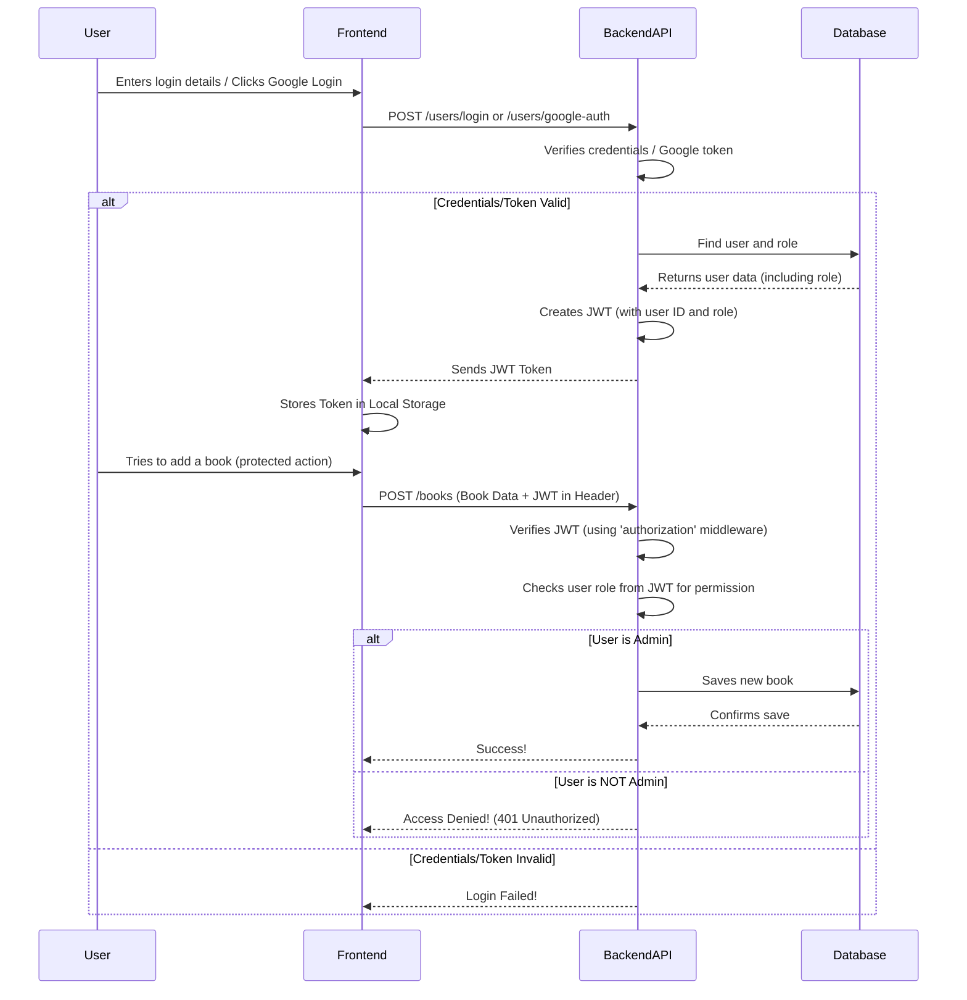

# Chapter 2: User Management & Authentication

Welcome back to `book-world`! In the [previous chapter](01_book_data_model___api_.md), we learned about how `book-world` organizes information about books (our "Book Data Model") and how different parts of our application talk to each other using the "API" to manage those books.

Now, imagine our `book-world` library is growing! We don't just want to show books; we want users to have their own accounts, save their favorite books, write reviews, and maybe even let special "admin" users add new books. This is where "User Management & Authentication" comes in.

Think of it like this: `book-world` is a building. In Chapter 1, we set up the library shelves and the system for finding books. In this chapter, we're building the front door, the reception desk, and assigning special keys.

This "abstraction" (which is just a fancy word for a system that handles a specific job) manages everything about people using `book-world`: from creating an account and logging in, to knowing who they are, what they're allowed to do, and even if they're a regular user or a special "admin." It's like having a bouncer and a guest list for our library's exclusive features.

## What is a User Account?

Just as a `Book` has a blueprint, a `User` also has a blueprint that defines what information we store about them.

Here's a simplified look at the kind of information `book-world` keeps for each user:

```javascript
// From: book-world-main/backend/models/users.js
const userSchema = new Schema({
  firstName: String, // User's first name
  lastName: String, // User's last name
  email: String, // Unique email for login
  password: String, // Their password (but not stored as plain text!)
  role: String, // Are they a "user" or "admin"?
  favoriteBooks: [], // A list of books they've favorited
  // ... other details like profile picture, liked comments/reviews
});
```

This `userSchema` (user blueprint) defines fields like `firstName`, `email`, and `password`. Notice the `role` field; this is how `book-world` knows if someone is a regular `user` or an `admin` with special powers (like adding new books!).

## Central Use Case: Signing Up and Logging In

The most common way users interact with `User Management & Authentication` is by signing up for a new account or logging into an existing one. Let's trace how this works.

### 1. Signing Up (Registration)

When a new user wants to join `book-world`, they fill out a "Sign Up" form.

**Frontend (What you see):**
The `SignupForm` component collects the user's details.

```javascript
// From: book-world-main/frontend/src/pages/Signup.jsx
import axios from "axios"; // Tool to make web requests
import { useForm } from "react-hook-form"; // For managing form data
// ... other imports for UI components

const SignupForm = () => {
  const form = useForm({
    /* ... form setup with validation ... */
  });
  const navigate = useNavigate();
  const [isLoading, setIsLoading] = useState(false);

  const onSubmit = (values) => {
    setIsLoading(true);
    let promise = axios.post(
      `${import.meta.env.VITE_BACKEND_URL}/users/signup`, // Send to signup API
      values // The user's entered data (name, email, password)
    );

    toast.promise(promise, {
      // Shows loading/success/error messages
      loading: "Loading...",
      success: (response) => {
        navigate("/login"); // Go to login page on success
        return response.data.message;
      },
      error: (error) => {
        /* ... error handling ... */
      },
      finally: () => setIsLoading(false),
    });
  };

  return (
    <form onSubmit={form.handleSubmit(onSubmit)}>
      {/* Input fields for firstName, lastName, email, password */}
      <Button type="submit">Create an account</Button>
    </form>
  );
};
```

This code sends the user's information to our backend API using a `POST` request to the `/users/signup` address.

**Backend (Under the Hood): Password Hashing**

When the backend receives the signup request, it doesn't store your password as plain text. Why? Because if someone hacked into our database, they would instantly know everyone's passwords! Instead, `book-world` uses a special one-way process called **hashing**.

Hashing takes your password and turns it into a long, random-looking string of characters (like `"$2a$10$fK0z..."`). This process cannot be reversed, so even if the hashed password is stolen, your original password remains secret. When you log in, `book-world` hashes your entered password and compares the _hash_ to the stored hash. If they match, it knows you entered the correct password without ever seeing the original.

Here's how the backend handles signup and hashing:

```javascript
// From: book-world-main/backend/controller/users.js
const bcrypt = require("bcryptjs"); // Library for password hashing
const User = require("../models/users"); // Our user blueprint

module.exports.signup = async (req, res) => {
  // Check if user already exists with this email
  const existingUser = await User.findOne({ email: req.body.email });
  if (existingUser) {
    throw new ExpressError(400, "Email already exists");
  }

  // Hash the password before saving
  const hashedPassword = await bcrypt.hash(req.body.password, 10);

  // Create a new user with the hashed password
  const newUser = new User({
    firstName: req.body.firstName,
    lastName: req.body.lastName,
    email: req.body.email,
    password: hashedPassword, // Store the hashed password
  });

  await newUser.save(); // Save the new user to the database

  res.status(201).json({ message: "User created successfully" });
};
```

This `signup` function first checks for duplicate emails, then uses `bcrypt.hash()` to securely hash the password before creating and saving the new `User` in the database.

### 2. Logging In (Authentication)

Once a user has an account, they can log in to access personalized features.

**Frontend (What you see):**
The `LoginForm` component collects the user's email and password.

```javascript
// From: book-world-main/frontend/src/pages/Login.jsx
import axios from "axios";
import { useForm } from "react-hook-form";
import { useRecoilState } from "recoil"; // For managing global state
import { isLoggedInAtom } from "@/atoms/userData";
// ... other imports

const LoginForm = () => {
  const [isLoggedIn, setIsLoggedIn] = useRecoilState(isLoggedInAtom);
  const navigate = useNavigate();
  const form = useForm({
    /* ... form setup ... */
  });
  const [isLoading, setIsLoading] = useState(false);

  const onSubmit = (values) => {
    setIsLoading(true);
    let promise = axios.post(
      `${import.meta.env.VITE_BACKEND_URL}/users/login`, // Send to login API
      values // User's email and password
    );

    toast.promise(promise, {
      loading: "Loading...",
      success: (response) => {
        const { token } = response.data;
        localStorage.setItem("token", token); // Store the JWT token!
        setIsLoggedIn(true); // Update global state
        navigate("/books");
        return response.data.message;
      },
      error: (error) => {
        /* ... error handling ... */
      },
      finally: () => setIsLoading(false),
    });
  };

  return (
    <form onSubmit={form.handleSubmit(onSubmit)}>
      {/* Input fields for email and password */}
      <Button type="submit">Login</Button>
    </form>
  );
};
```

This code sends the login credentials to the backend. If successful, the backend sends back something called a **JWT Token**. This token is like a special ID card that proves who you are without sending your password every time. The frontend then stores this token (usually in `localStorage`) for future use.

**Backend (Under the Hood): JWT Tokens**

When you successfully log in, the backend creates a **JSON Web Token (JWT)**. This token is a compact, secure way for `book-world` to confirm your identity. It contains information about you (like your user ID and role) and is digitally signed by the server.

Whenever you want to do something that requires you to be logged in (like adding a book, favoriting one, or viewing your profile), your browser sends this JWT token along with the request. The backend then verifies the token's signature to ensure it hasn't been tampered with and uses the information inside to know who you are and what permissions you have.

Here's how the backend handles login and JWT creation:

```javascript
// From: book-world-main/backend/controller/users.js
const { SignJWT } = require("jose"); // Library for JWT
const User = require("../models/users");
const bcrypt = require("bcryptjs");

module.exports.login = async (req, res) => {
  const user = await User.findOne({ email: req.body.email });
  if (!user) {
    /* ... handle invalid email ... */
  }

  const validPassword = await bcrypt.compare(req.body.password, user.password);
  if (!validPassword) {
    /* ... handle invalid password ... */
  }

  // Create JWT payload: user's ID and role
  const payload = { id: user._id, role: user.role };

  // Sign the JWT
  const secret = process.env.JWT_SECRET; // A secret key known only to the server
  const secretBytes = new TextEncoder().encode(secret);
  const signer = new SignJWT(payload)
    .setProtectedHeader({ alg: "HS256" })
    .setIssuedAt();
  const token = await signer.sign(secretBytes);

  res.status(200).json({
    token, // Send the JWT back to the frontend
    role: user.role,
    message: `Welcome ${user.firstName}!`,
  });
};
```

After verifying the password, the `login` function creates a `payload` containing the user's `_id` and `role`. It then uses a secret key to sign this payload and generates the `token`, which is sent back to the frontend.

### 3. Logging in with Google (OAuth)

`book-world` also lets you sign in using your Google account, which is super convenient! This uses a standard called **OAuth** (Open Authorization). Instead of creating a new password, you simply tell Google that you want to use your Google account to log into `book-world`.

**Frontend (What you see):**
A `GoogleLogin` button is provided by the `@react-oauth/google` library.

```javascript
// From: book-world-main/frontend/src/components/OauthLogin.jsx
import { GoogleLogin } from "@react-oauth/google";
import axios from "axios";
import { useNavigate } from "react-router-dom";
import { useRecoilState } from "recoil";
import { isLoggedInAtom } from "@/atoms/userData";

export const OauthLogin = () => {
  const [isLoggedIn, setIsLoggedIn] = useRecoilState(isLoggedInAtom);
  const navigate = useNavigate();

  return (
    <GoogleLogin
      onSuccess={async (credentialResponse) => {
        let promise = axios.post(
          `${import.meta.env.VITE_BACKEND_URL}/users/google-auth`,
          {
            token: credentialResponse.credential, // Google's special token
            auth_method: "google",
          }
        );
        toast.promise(promise, {
          /* ... handles success/error similar to regular login ... */
          success: (response) => {
            const { token } = response.data;
            localStorage.setItem("token", token);
            setIsLoggedIn(true);
            navigate("/books");
            return response.data.message;
          },
        });
      }}
      // ... other GoogleLogin configurations ...
    />
  );
};
```

When you click the "Sign in with Google" button and select your account, Google provides `book-world` with a special `credentialResponse.credential` (which is another kind of token). The frontend then sends this token to our backend.

**Backend (Under the Hood): Verifying Google Token**

Our backend uses Google's own tools to verify that the token sent by the frontend is real and came from Google. It then uses the information from this verified token (like your name and email) to either create a new user account (if it's your first time logging in with Google) or log you into your existing one.

```javascript
// From: book-world-main/backend/middleware/auth.js (Simplified)
const { OAuth2Client } = require("google-auth-library");
const client = new OAuth2Client();

async function verifyGoogleToken(token) {
  const ticket = await client.verifyIdToken({
    idToken: token,
    audience: process.env.GOOGLE_CLIENT_ID, // Our app's Google ID
  });
  return ticket.getPayload(); // Returns user's info like email, name, picture
}

module.exports.googleAuthMiddleware = async (req, res, next) => {
  if (req.body.auth_method === "google") {
    verifyGoogleToken(req.body.token)
      .then((payload) => {
        // Attach user info from Google to the request body
        req.body.firstName = payload.given_name;
        req.body.lastName = payload.family_name;
        req.body.email = payload.email;
        req.body.picture = payload.picture;
        next(); // Continue to the controller function
      })
      .catch((err) => {
        res.status(403).json({ message: "Invalid Google Token" });
      });
  } else {
    next(); // Not a Google login, skip this middleware
  }
};
```

The `googleAuthMiddleware` acts as a gatekeeper. If the request is a Google login, it calls `verifyGoogleToken` to check if Google's token is valid. If it is, it extracts user details from Google's response and attaches them to the request (`req.body`), so the next function can use them.

```javascript
// From: book-world-main/backend/controller/users.js
const User = require("../models/users");
const { SignJWT } = require("jose");

module.exports.googleAuth = async (req, res) => {
  let user = await User.findOne({ email: req.body.email });

  if (!user) {
    // If user doesn't exist, create a new one
    user = new User({
      firstName: req.body.firstName,
      lastName: req.body.lastName,
      email: req.body.email,
      picture: req.body.picture,
      auth_method: "google",
    });
    await user.save();
  } else {
    // If user exists, update their picture and auth method
    user.auth_method = "google";
    user.picture = req.body.picture;
    await user.save();
  }

  // Generate and send back a JWT token for our book-world app
  const payload = { id: user._id, role: user.role };
  const secretBytes = new TextEncoder().encode(process.env.JWT_SECRET);
  const signer = new SignJWT(payload)
    .setProtectedHeader({ alg: "HS256" })
    .setIssuedAt();
  const token = await signer.sign(secretBytes);

  res.status(200).json({
    token,
    role: user.role,
    message: `Welcome ${user.firstName}!`,
  });
};
```

After the `googleAuthMiddleware` verifies the token, the `googleAuth` controller function takes over. It checks if a user with that email already exists. If not, it creates a new `User` record, marking their `auth_method` as "google." If they do exist, it updates their profile picture and sets their auth method. Finally, it generates a regular `book-world` JWT token for them, just like a local login.

## Under the Hood: How User Authentication Works with JWT

Let's put it all together to see how the JWT token ensures you're authorized to do things in `book-world`.



1.  **Login Request**: The user enters their email/password or uses Google Login. The `Frontend` sends this to the `BackendAPI`.
2.  **Backend Verification**: The `BackendAPI` verifies the credentials (email/password hash or Google token).
3.  **JWT Creation**: If valid, the `BackendAPI` finds the user's `id` and `role` from the `Database` and creates a **JWT (JSON Web Token)**. This token contains a small amount of encrypted data about the user (like their ID and role) and is signed by the server's secret key.
4.  **Token Storage**: The `BackendAPI` sends this `JWT Token` back to the `Frontend`. The `Frontend` stores it securely, typically in your browser's `localStorage`.
5.  **Subsequent Protected Requests**: When the user tries to perform an action that requires them to be logged in (like adding a book, which we saw in [Chapter 1: Book Data Model & API](01_book_data_model___api_.md)), the `Frontend` includes this `JWT Token` in the "Authorization" header of every request.
6.  **Token Verification (Middleware)**: On the backend, before any "protected" route (like adding a book or managing users) processes the request, a special function called **authorization middleware** runs. This middleware checks the JWT. It:
    - Makes sure the token exists and is in the correct format.
    - Verifies the token's signature using the same secret key used to create it. If the signature is invalid, the token was tampered with, or it's expired.
    - Extracts the user's `id` and `role` from the token and attaches them to the request (`req.userId`, `req.role`).
7.  **Role-Based Access Control**: After the token is verified, the route's main function can check `req.role` to decide if the user has permission to perform that action. For example, adding a book might only be allowed if `req.role` is "admin." If not, the request is rejected with a "Not Authorized" message.

### Backend Code: The `authorization` Middleware

The `authorization` middleware is crucial for protecting our API routes.

```javascript
// From: book-world-main/backend/middleware/auth.js
const { jwtVerify } = require("jose"); // Library to verify JWTs

module.exports.authorization = async (req, res, next) => {
  try {
    const authHeader = req.headers.authorization;
    // Check if Authorization header exists and starts with "Bearer "
    if (!authHeader || !authHeader.startsWith("Bearer ")) {
      return res.status(403).json({ message: "Not Authenticated" });
    }

    const token = authHeader.split(" ")[1]; // Get the token part
    const secret = process.env.JWT_SECRET;
    const secretBytes = new TextEncoder().encode(secret);

    // Verify the token's signature and get its payload
    const { payload } = await jwtVerify(token, secretBytes);

    // Attach user ID and role from token to the request object
    req.userId = payload.id;
    req.role = payload.role;

    next(); // Continue to the next middleware or route handler
  } catch (err) {
    // Handle invalid or expired tokens
    res.status(403).json({ message: "Invalid Token" });
  }
};
```

This middleware sits in front of protected routes. It intercepts requests, extracts the JWT, verifies it, and if valid, adds the user's `id` and `role` to the `req` (request) object. This makes it easy for our controller functions to know who is making the request and what their permissions are.

Remember the `createBook` function from Chapter 1? It used this middleware:

```javascript
// From: book-world-main/backend/router/book.js
router.route("/").post(
  authorization, // This runs first! It verifies JWT and sets req.role
  upload.single("image"),
  bookController.createBook
);
```

And inside `createBook`, we could then check `req.role`:

```javascript
// From: book-world-main/backend/controller/books.js
module.exports.createBook = async (req, res) => {
  if (req.role !== "admin") {
    // This check is now possible thanks to 'authorization' middleware
    throw new ExpressError(401, "You are not Authorized to Add Book");
  }
  // ... rest of the create book logic ...
};
```

### Frontend Code: Getting User Data After Login

Once logged in, the frontend needs to know details about the current user (their role, their liked books, etc.) to display the right content.

```javascript
// From: book-world-main/frontend/src/hooks/useUserData.js
import { useEffect } from "react";
import axios from "axios";
import { useSetRecoilState, useRecoilState } from "recoil";
import {
  isLoggedInAtom,
  userRoleAtom,
  userIdAtom,
  usersFavouriteBooksAtom,
  likedReviewsAtom,
  likedCommentsAtom,
  userAvatarSelector,
} from "@/atoms/userData";

const useUserData = () => {
  const [isLoggedIn, setIsLoggedIn] = useRecoilState(isLoggedInAtom);
  const setUserRole = useSetRecoilState(userRoleAtom);
  const setUserId = useSetRecoilState(userIdAtom);
  const setUsersFavouriteBooks = useSetRecoilState(usersFavouriteBooksAtom);
  const setLikedReviews = useSetRecoilState(likedReviewsAtom);
  const setLikedComments = useSetRecoilState(likedCommentsAtom);
  const setUserAvatar = useSetRecoilState(userAvatarSelector);

  const fetchUser = async () => {
    axios
      .get(`${import.meta.env.VITE_BACKEND_URL}/users/me`, {
        headers: {
          Authorization: `Bearer ${localStorage.getItem("token")}`, // Send the JWT!
        },
      })
      .then((response) => {
        // Update various global states with user data
        setUserRole(response.data.user.role);
        setUserId(response.data.user._id);
        setUserAvatar(response.data.user.picture || "");
        setIsLoggedIn(true);
        setUsersFavouriteBooks(response.data.user.favoriteBooks || []);
        setLikedReviews(response.data.user.likedReviews || []);
        setLikedComments(response.data.user.likedComments || []);
      })
      .catch((error) => {
        /* ... error handling ... */
      });
  };

  useEffect(() => {
    if (isLoggedIn) {
      // Only fetch if theoretically logged in
      fetchUser();
    }
    // ... logic to clear user data if not logged in ...
  }, [isLoggedIn]); // Re-run when isLoggedIn state changes

  return [isLoggedIn, setIsLoggedIn];
};
```

The `useUserData` hook runs when the application starts or when the `isLoggedIn` state changes. It makes a `GET` request to `/users/me`, **including the JWT token** in the `Authorization` header. The backend then uses the token to identify the user and sends back their profile data, which the frontend stores in its global state (using Recoil, which we'll cover in [Chapter 6: Frontend Global State (Recoil)](06_frontend_global_state__recoil__.md)).

## Example: User Favorites and Admin View

With user management in place, `book-world` can offer personalized features. For instance, a logged-in user can mark books as "favorites." Also, an admin can view all users.

**1. Toggling a Book as Favorite**

A user clicks a heart icon on a book.

```javascript
// Simplified backend action for toggling favorites
// From: book-world-main/backend/controller/users.js
const User = require("../models/users");
const Book = require("../models/books");

module.exports.toggleFavouriteBook = async (req, res) => {
  const userId = req.userId; // This comes from the JWT via authorization middleware!
  const { bookId } = req.body;

  const user = await User.findById(userId); // Find the current user
  const book = await Book.findById(bookId); // Find the book

  if (!user || !book) {
    /* ... handle not found ... */
  }

  const isFavorite = user.favoriteBooks.includes(bookId);
  if (isFavorite) {
    user.favoriteBooks.pull(bookId); // Remove if already favorite
  } else {
    user.favoriteBooks.push(bookId); // Add if not favorite
  }
  await user.save();
  res.status(200).json({
    message: isFavorite
      ? "Book removed from favourites"
      : "Book added to favourites",
  });
};
```

Notice how `req.userId` is used here. Because the `authorization` middleware ran first, this function _already_ knows exactly which user is making the request! It doesn't need to ask for a user ID in the request body, making it more secure and easier to use.

**2. Viewing All Users (Admin-Only)**

Only users with the "admin" role can see a list of all users in `book-world`.

```javascript
// From: book-world-main/frontend/src/pages/Users.jsx
import axios from "axios";
import { useEffect, useState } from "react";
import { toast } from "sonner";

const Users = () => {
  const [users, setUsers] = useState([]);
  const [isLoading, setIsLoading] = useState(false);

  useEffect(() => {
    setIsLoading(true);
    axios
      .get(`${import.meta.env.VITE_BACKEND_URL}/users/`, {
        headers: {
          Authorization: `Bearer ${localStorage.getItem("token")}`, // Send JWT
        },
      })
      .then((response) => setUsers(response.data.users))
      .catch((error) => {
        if (error.response?.data?.message) {
          toast.error(error.response.data.message); // Will show "Not Authorized" for non-admins
        } else { /* ... generic error ... */ }
      })
      .finally(setIsLoading(false));
  }, []); // Run once on component load

  if (isLoading) { /* ... loading spinner ... */ }

  return (
    <main>
      {users ? (
        <div className="grid">
          {users?.map((user, index) => ( /* ... render UserCard for each user ... */ ))}
        </div>
      ) : (
        <div className="text-center"> {/* Shown if not authorized */}
          <h1 className="text-7xl">401</h1>
          <p className="text-3xl">Not Authorized</p>
        </div>
      )}
    </main>
  );
};
```

When a user tries to access the `/users` page, the frontend sends a `GET` request with their JWT. If they're not an admin, the backend (using the `authorization` middleware and the `getAllUsers` controller function) will block the request and send back an "Access Denied" message, which is then displayed to the user.

```javascript
// From: book-world-main/backend/controller/users.js
const User = require("../models/users");

module.exports.getAllUsers = async (req, res) => {
  if (req.role !== "admin") {
    // Only allow if user role is "admin"
    throw new ExpressError(401, "You are not Authorized to view all users");
  }
  // If authorized, fetch all users (excluding passwords for security)
  const users = await User.find({}, "-password");
  res.json({ users });
};
```

This demonstrates how `book-world` protects sensitive information and features using roles.

## Conclusion

In this chapter, you've learned how `book-world` manages its users, ensuring a secure and personalized experience:

- **User Data Model**: How we define and store user information, including their `role`.
- **Registration & Login**: The processes for creating an account and signing in, with **password hashing** for security and **JWT tokens** for identity verification.
- **Google OAuth**: How third-party logins are integrated.
- **User Roles & Permissions**: How `book-world` distinguishes between regular users and `admin`s, using JWTs and backend middleware to enforce **access control**.

Understanding user management and authentication is vital for building any secure, multi-user application. You now have a solid grasp of how `book-world` acts as a bouncer, only letting authorized users access certain features.

Next, we'll dive into how users can interact with books and each other by adding reviews and comments in [Chapter 3: Review & Comment System](03_review___comment_system_.md).

---

<sub><sup>Generated by [AI Codebase Knowledge Builder](https://github.com/The-Pocket/Tutorial-Codebase-Knowledge).</sup></sub> <sub><sup>**References**: [[1]](https://github.com/Manoj10211021/book-world/blob/b03e43c9da8c776fde0894d0423c8f8ef785bb9b/book-world-main/backend/controller/users.js), [[2]](https://github.com/Manoj10211021/book-world/blob/b03e43c9da8c776fde0894d0423c8f8ef785bb9b/book-world-main/backend/middleware/auth.js), [[3]](https://github.com/Manoj10211021/book-world/blob/b03e43c9da8c776fde0894d0423c8f8ef785bb9b/book-world-main/backend/models/users.js), [[4]](https://github.com/Manoj10211021/book-world/blob/b03e43c9da8c776fde0894d0423c8f8ef785bb9b/book-world-main/backend/router/users.js), [[5]](https://github.com/Manoj10211021/book-world/blob/b03e43c9da8c776fde0894d0423c8f8ef785bb9b/book-world-main/frontend/src/atoms/userData.jsx), [[6]](https://github.com/Manoj10211021/book-world/blob/b03e43c9da8c776fde0894d0423c8f8ef785bb9b/book-world-main/frontend/src/components/OauthLogin.jsx), [[7]](https://github.com/Manoj10211021/book-world/blob/b03e43c9da8c776fde0894d0423c8f8ef785bb9b/book-world-main/frontend/src/hooks/useUserData.js), [[8]](https://github.com/Manoj10211021/book-world/blob/b03e43c9da8c776fde0894d0423c8f8ef785bb9b/book-world-main/frontend/src/pages/Login.jsx), [[9]](https://github.com/Manoj10211021/book-world/blob/b03e43c9da8c776fde0894d0423c8f8ef785bb9b/book-world-main/frontend/src/pages/Signup.jsx), [[10]](https://github.com/Manoj10211021/book-world/blob/b03e43c9da8c776fde0894d0423c8f8ef785bb9b/book-world-main/frontend/src/pages/UserDetails.jsx), [[11]](https://github.com/Manoj10211021/book-world/blob/b03e43c9da8c776fde0894d0423c8f8ef785bb9b/book-world-main/frontend/src/pages/Users.jsx), [[12]](https://github.com/Manoj10211021/book-world/blob/b03e43c9da8c776fde0894d0423c8f8ef785bb9b/tests/backend/controllers/users.test.js), [[13]](https://github.com/Manoj10211021/book-world/blob/b03e43c9da8c776fde0894d0423c8f8ef785bb9b/tests/backend/middleware/auth.test.js)</sup></sub>
