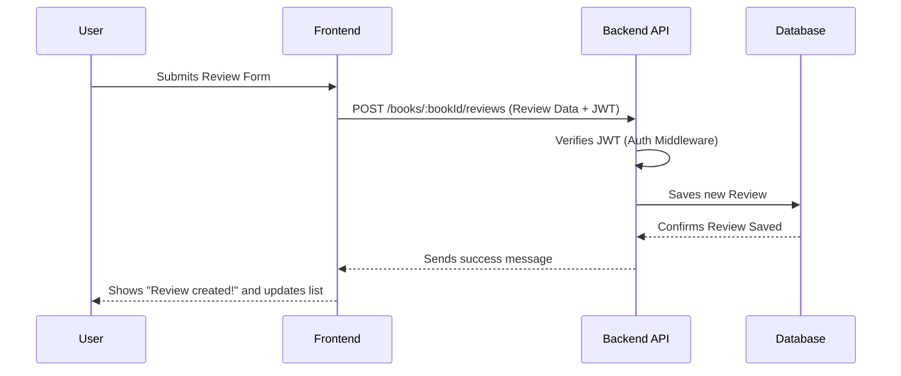

# Chapter 3: Review & Comment System

Welcome back, `book-world` explorer! In the [previous chapter](02_user_management___authentication_.md), we learned how `book-world` manages user accounts, handles logins, and keeps our library secure using JWT tokens. Now that users can sign up and log in, they'll want to do more than just browse books; they'll want to share their thoughts, opinions, and discuss their favorite reads!

Imagine you've just finished an amazing book. You want to tell everyone how great it was, give it a 5-star rating, and see what others thought. You might also want to ask a question about a plot point or reply to someone else's comment. This is exactly what the "Review & Comment System" enables in `book-world`.

This system is like the interactive feedback section for each book. It allows users to write detailed _reviews_, give _ratings_, and then have back-and-forth _discussions_ through _comments_ and even _nested replies_ (comments on comments!). It also lets users "like" reviews and comments, showing appreciation for helpful feedback.

## What is a Review?

In `book-world`, a "Review" is a piece of feedback a user leaves for a specific book. It usually includes a star rating and some written content.

Here's a simplified look at the blueprint (`Schema`) for a Review:

```javascript
// From: book-world-main/backend/models/review.js
const reviewSchema = new Schema({
  bookId: {
    /* ... link to the book ... */
  },
  userId: {
    /* ... link to the user who wrote it ... */
  },
  content: String, // The written review (e.g., "Loved this book!")
  rating: Number, // How many stars (1 to 5)
  createdAt: Date, // When it was written
  comments: [], // A list of IDs of comments on this review
  likes: Number, // How many likes it has
  likedBy: [], // A list of IDs of users who liked it
});

// IMPORTANT: A user can only review a book once!
reviewSchema.index({ bookId: 1, userId: 1 }, { unique: true });
```

Key things to notice:

- `bookId` and `userId`: These connect the review to a specific book and the user who wrote it.
- `content` and `rating`: These are the main parts of the review.
- `comments` and `likes`: Reviews can have comments and can be "liked" by other users.
- `unique: true` on `bookId` and `userId`: This is a rule that makes sure one user can only write _one_ review for a particular book. They can't submit multiple reviews for the same book.

## What is a Comment?

A "Comment" in `book-world` is a reply to a review or to another comment. This allows for deeper discussions.

Here's the simplified blueprint (`Schema`) for a Comment:

```javascript
// From: book-world-main/backend/models/comments.js
const commentSchema = new Schema({
  reviewId: {
    /* ... link to the review it belongs to ... */
  },
  userId: {
    /* ... link to the user who wrote it ... */
  },
  content: String, // The text of the comment
  createdAt: Date, // When it was written
  parent: {
    /* ... link to another comment if it's a reply ... */
  },
  replies: [], // A list of IDs of comments replying to this one
  likes: Number, // How many likes it has
  likedBy: [], // A list of IDs of users who liked it
});
```

Notice the `parent` and `replies` fields. These are what make our comment system "nested," meaning you can reply to a comment, and then someone can reply to _that_ reply, creating a conversation thread!

## Use Case: Writing a Review for a Book

Let's walk through the most common use case: a user wants to write a review for a book they've read.

### Frontend: User Submits Review

When you are on a book's page, you'll see a form to write a review. After typing your thoughts and selecting a rating, you click "Submit."

```javascript
// From: book-world-main/frontend/src/components/ReviewForm.jsx (Simplified)
import axios from "axios";
import { useRecoilValue } from "recoil";
import { isLoggedInAtom } from "@/atoms/userData";
import { useNavigate } from "react-router-dom";
import { toast } from "sonner"; // For showing success/error messages

const ReviewForm = ({ book, isEditing, reviewId, handleUserReply }) => {
  const isLoggedIn = useRecoilValue(isLoggedInAtom); // Check if user is logged in
  const navigate = useNavigate(); // For redirecting if not logged in

  const onSubmit = (values) => {
    // values will contain { content: "...", rating: 5 }
    let promise = axios.post(
      `${import.meta.env.VITE_BACKEND_URL}/books/${book._id}/reviews/`, // API endpoint
      values, // The review content and rating
      {
        headers: {
          Authorization: `Bearer ${localStorage.getItem("token")}`, // Send JWT
        },
      }
    );

    toast.promise(promise, {
      success: (response) => {
        handleUserReply(); // Callback to update reviews list
        return response.data.message;
      },
      error: (error) => {
        if (!isLoggedIn) {
          navigate("/login"); // If not logged in, redirect to login page
          return "You need to Login to write a review";
        }
        // ... more detailed error handling ...
      },
    });
  };

  return (
    // ... form structure with input fields for content and rating ...
    <form onSubmit={form.handleSubmit(onSubmit)}>
      {/* ... rating stars and textarea ... */}
      <Button type="submit">Submit</Button>
    </form>
  );
};
```

This `ReviewForm` takes the user's input (`content` and `rating`) and sends it to our backend using an `axios.post` request. Crucially, it includes the **JWT token** (from [Chapter 2: User Management & Authentication](02_user_management___authentication_.md)) in the `Authorization` header, so the backend knows _who_ is submitting the review.

### Under the Hood: Creating a Review

Here's what happens when the frontend sends the review data to the backend:



1.  **User Submits Form**: You click "Submit" on the review form.
2.  **Frontend Sends Request**: The `Frontend` sends a `POST` request to the `/books/:bookId/reviews` endpoint on the `Backend API`. It includes the review content, rating, and your **JWT token**.
3.  **Backend Verifies User**: The `Backend API` first uses the `authorization` middleware (from Chapter 2) to check your JWT token. This confirms you are logged in and identifies your user ID.
4.  **Backend Saves Review**: The backend's review controller then takes the review data and your user ID, creates a new `Review` record, and saves it into the `Database`. It also ensures that you haven't already reviewed this book.
5.  **Database Updates Book Stats**: (Behind the scenes) When a new review is saved, `book-world` automatically updates the `Book`'s `averageRating` and `totalReviews`. So, if a 5-star review is added, the book's average rating goes up!
6.  **Backend Responds**: The `Backend API` sends a success message back to the `Frontend`.
7.  **Frontend Updates**: The `Frontend` displays a success message and refreshes the list of reviews to show your new review.

### Backend Code: Creating a Review

On the backend, the `reviews` controller handles the creation of a review.

```javascript
// From: book-world-main/backend/controller/reviews.js (Simplified)
const Review = require("../models/review"); // Our Review blueprint
// ... other imports ...

module.exports.createReview = async (req, res) => {
  const bookId = req.params.id; // Get the book ID from the URL
  const { content, rating } = req.body; // Get review content and rating
  const userId = req.userId; // Get user ID from the JWT (set by auth middleware)

  // Check if user already reviewed this book (handled by unique index on schema,
  // but explicit check here would be good for custom error message)
  // For simplicity, we rely on the schema's unique index for now.

  const review = new Review({ bookId, content, rating, userId }); // Create new review
  await review.save(); // Save the new review to the database

  res.json({ review, message: "Review created successfully" });
};
```

This `createReview` function takes the `bookId` from the URL, the `content` and `rating` from the request body, and your `userId` (which the `authorization` middleware conveniently added to `req`). It then creates a new `Review` document and saves it.

## Extending the System: Comments and Likes

Our system doesn't stop at reviews! Users can also comment on reviews, reply to comments, and "like" reviews and comments.

### Adding a Comment to a Review

Let's say you see a review and want to add a comment to it.

**Frontend:**

You'll see a "Comment" button on each review. Clicking it reveals a text area to type your comment.

```javascript
// From: book-world-main/frontend/src/components/ReviewCard.jsx (Simplified)
import axios from "axios";
import { toast } from "sonner";

const ReviewCard = ({ review, bookId, handleParentReload }) => {
  // ... other state and functions ...
  const [comment, setComment] = useState(""); // Stores user's typed comment

  const handleSubmit = async (event) => {
    event.preventDefault();
    if (!comment) {
      toast.error("Please write a comment");
      return;
    }
    const promise = axios.post(
      `${import.meta.env.VITE_BACKEND_URL}/books/${bookId}/reviews/${review._id}/comments`, // API endpoint
      { content: comment }, // Send the comment content
      {
        headers: {
          Authorization: `Bearer ${localStorage.getItem("token")}`, // Send JWT
        },
      }
    );

    toast.promise(promise, {
      success: (response) => {
        handleParentReload(); // Tell the parent (ReviewList) to refresh
        return response.data.message;
      },
      error: (error) => { /* ... error handling ... */ },
    });
  };

  return (
    // ... review content ...
    {showForm && (
      <form onSubmit={handleSubmit}> {/* Comment form */}
        <Textarea
          placeholder="Comment here ..."
          value={comment}
          onChange={(e) => setComment(e.target.value)}
        />
        <Button type="submit">Submit</Button>
      </form>
    )}
    // ... comments list ...
  );
};
```

This code sends a `POST` request to an API endpoint that includes the `bookId` and `review._id`, along with the `content` of the comment.

**Backend: Creating a Comment**

```javascript
// From: book-world-main/backend/controller/comments.js (Simplified)
const Comment = require("../models/comments");
const Review = require("../models/review");

module.exports.createComment = async (req, res) => {
  const { reviewId } = req.params; // Get review ID from URL
  const { content } = req.body;
  const userId = req.userId; // User ID from JWT

  const review = await Review.findById(reviewId); // Find the review
  if (!review) {
    throw new ExpressError(400, "Review not found");
  }

  const newComment = new Comment({ content, userId, reviewId }); // Create new comment
  await newComment.save(); // Save the comment

  review.comments.push(newComment); // Add comment to review's 'comments' list
  await review.save(); // Save the updated review

  res.status(201).json({ newComment, message: "Comment created successfully" });
};
```

When a comment is created, it's saved as a separate `Comment` document, and its ID is added to the `comments` array of the `Review` it belongs to.

### Nested Replies: Comments on Comments

Our system supports replies to comments! This is what the `parent` and `replies` fields in the `Comment` schema are for.

**Frontend:**

Similar to reviews, each comment card will have a reply button.

```javascript
// From: book-world-main/frontend/src/components/CommentCard.jsx (Simplified)
import axios from "axios";
import { toast } from "sonner";

const CommentCard = ({ comment, bookId, reviewId, handleParentReloadReply }) => {
  // ... other state and functions ...
  const [myComment, setMyComment] = useState(""); // For nested reply

  const handleSubmit = async (event) => {
    event.preventDefault();
    const promise = axios.post(
      `${import.meta.env.VITE_BACKEND_URL}/books/${bookId}/reviews/${reviewId}/comments/${comment._id}`, // API endpoint for nested comment
      { content: myComment },
      {
        headers: {
          Authorization: `Bearer ${localStorage.getItem("token")}`,
        },
      }
    );

    toast.promise(promise, {
      success: (response) => {
        handleParentReloadReply(); // Tell the parent (ReviewCard or another CommentCard) to refresh
        return response.data.message;
      },
      error: (error) => { /* ... error handling ... */ },
    });
  };

  return (
    // ... comment content ...
    {showForm && (
      <form onSubmit={handleSubmit}> {/* Nested comment form */}
        <Textarea
          placeholder="Comment here..."
          value={myComment}
          onChange={(e) => setMyComment(e.target.value)}
        />
        <Button type="submit">Submit</Button>
      </form>
    )}
    // ... nested replies list ...
  );
};
```

The key difference here is the URL: it now includes `comments/:comment._id`, indicating that this is a reply to a specific comment.

**Backend: Creating a Nested Comment**

```javascript
// From: book-world-main/backend/controller/comments.js (Simplified)
const Comment = require("../models/comments");

module.exports.createNestedComment = async (req, res) => {
  const { commentId } = req.params; // The ID of the parent comment
  const { content } = req.body;
  const userId = req.userId;

  const parentComment = await Comment.findById(commentId); // Find the parent comment
  if (!parentComment) {
    throw new ExpressError(400, "Comment not found");
  }

  const reply = new Comment({
    content,
    userId,
    reviewId: parentComment.reviewId, // Inherit reviewId from parent
    parent: commentId, // Link to the parent comment
  });
  await reply.save();

  parentComment.replies.push(reply); // Add reply to parent comment's 'replies' list
  await parentComment.save();

  res.status(201).json({ reply, message: "Reply created successfully" });
};
```

Here, the `reply` comment gets a `parent` ID, linking it to its parent comment. Its ID is then added to the `replies` array of the `parentComment`. This is how threads are built!

### Liking Reviews and Comments

Users can show appreciation by "liking" reviews and comments. This updates a `likes` counter and stores which users have liked it.

**Frontend:**

A `ThumbsUp` icon (or similar) will be a button.

```javascript
// From: book-world-main/frontend/src/components/ReviewCard.jsx (Simplified)
import axios from "axios";
import { toast } from "sonner";

const ReviewCard = ({ review, bookId }) => {
  const role = useRecoilValue(userRoleAtom);
  const [isLiked, setIsLiked] = useState(false); // Tracks if current user liked it

  const toggleLike = async () => {
    if (!role) {
      // User must be logged in (have a role)
      toast.error("You need to be logged in");
      return;
    }

    axios
      .post(
        `${import.meta.env.VITE_BACKEND_URL}/books/${bookId}/reviews/${
          review._id
        }/like`, // API endpoint
        {}, // No body needed for like/unlike toggle
        {
          headers: {
            Authorization: `Bearer ${localStorage.getItem("token")}`,
          },
        }
      )
      .then((response) => {
        setIsLiked(!isLiked); // Toggle liked state visually
        toast.success(response.data.message); // Show success/unliked message
      })
      .catch((error) => {
        /* ... error handling ... */
      });
  };

  return (
    // ... review content ...
    <Button onClick={toggleLike}>
      <ThumbsUp />
      <span>{isLiked ? "Liked" : "Like"}</span>
    </Button>
  );
};
```

The frontend sends a simple `POST` request to the `/like` endpoint. The backend handles the logic of adding or removing the like.

**Backend: Liking a Review (Similar for Comments)**

```javascript
// From: book-world-main/backend/controller/reviews.js (Simplified)
const Review = require("../models/review");
const User = require("../models/users");

module.exports.likeReview = async (req, res) => {
  const reviewId = req.params.reviewId;
  const userId = req.userId; // User ID from JWT

  const user = await User.findById(userId); // Find the current user
  const isLiked = user.likedReviews.includes(reviewId); // Check if user already liked this review

  if (isLiked) {
    // If already liked, unlike it
    await Review.findByIdAndUpdate(reviewId, {
      $inc: { likes: -1 }, // Decrease like count
      $pull: { likedBy: userId }, // Remove user from likedBy list
    });
    await User.findByIdAndUpdate(userId, {
      $pull: { likedReviews: reviewId }, // Remove review from user's likedReviews
    });
    return res.json({ message: "Review unliked successfully" });
  }

  // If not liked, like it
  await Review.findByIdAndUpdate(reviewId, {
    $inc: { likes: 1 }, // Increase like count
    $addToSet: { likedBy: userId }, // Add user to likedBy list
  });
  await User.findByIdAndUpdate(userId, {
    $addToSet: { likedReviews: reviewId }, // Add review to user's likedReviews
  });
  res.json({ message: "Review liked successfully" });
};
```

This function does two main things:

1.  It checks if the `userId` is already in the `likedBy` list of the review.
2.  Based on that, it either increments/decrements the `likes` count and adds/removes the `userId` from the `likedBy` array on the `Review` (or `Comment`) document.
3.  It also updates the `likedReviews` (or `likedComments`) array on the `User` document, so the user's profile knows which reviews/comments they've liked.

## Viewing Reviews and Comments

To display reviews and comments on a book's page, the frontend requests them from the backend.

**Frontend:**

```javascript
// From: book-world-main/frontend/src/components/ReviewList.jsx (Simplified)
import axios from "axios";
import { useEffect, useState } from "react";

const ReviewList = ({ book, userReplyCounter }) => {
  const [reviews, setReviews] = useState([]);
  const [isLoading, setIsLoading] = useState(true);

  useEffect(() => {
    setIsLoading(true);
    axios
      .get(`${import.meta.env.VITE_BACKEND_URL}/books/${book._id}/reviews/`) // Request all reviews for this book
      .then((response) => {
        setReviews(response.data.reviews); // Store the reviews
      })
      .catch((err) => {
        /* ... error handling ... */
      })
      .finally(() => setIsLoading(false));
  }, [book._id, userReplyCounter]); // Reload when book changes or user replies

  // ... calculate average rating and display ...

  return (
    <section>
      {reviews.length !== 0 ? (
        reviews?.map((review, index) => (
          <ReviewCard key={index} review={review} bookId={book._id} /> // Display each review
        ))
      ) : (
        <h3>No Reviews yet!</h3>
      )}
    </section>
  );
};
```

The `ReviewList` component fetches all reviews for a specific `book._id`. Once received, it renders each one using a `ReviewCard` component.

**Backend: Getting All Reviews**

```javascript
// From: book-world-main/backend/controller/reviews.js (Simplified)
const Review = require("../models/review");

module.exports.getAllReviews = async (req, res) => {
  const bookId = req.params.id; // Get book ID from URL

  const reviews = await Review.find({ bookId }) // Find all reviews for this book
    .populate("userId", "-password -favoriteBooks"); // Get user details for each review

  res.json({ reviews }); // Send back the list of reviews
};
```

The `populate("userId", ...)` part is important: it tells the database to automatically fetch the user details (like `firstName`, `lastName`, `picture`) for each `userId` linked to a review, so the frontend can display the reviewer's name and avatar. We explicitly exclude sensitive info like `password`.

Similarly, there are API endpoints to `getComments` and `getNestedComments` which work in the same way, populating user data and nested replies as needed.

## Deleting Reviews and Comments

Deleting a review or a comment can be a bit tricky because of the nested structure. If a review is deleted, all its comments should also be deleted. If a comment is deleted, all its replies should also be deleted.

**Frontend:**

Only the author of a review/comment, or an `admin` user, can delete it. A confirmation dialog appears before deletion.

```javascript
// From: book-world-main/frontend/src/components/ReviewCard.jsx (Simplified)
import axios from "axios";
import { toast } from "sonner";
import { useRecoilValue } from "recoil";
import { userIdAtom, userRoleAtom } from "@/atoms/userData";

const ReviewCard = ({ review, bookId, handleParentReload }) => {
  const userId = useRecoilValue(userIdAtom); // Current logged-in user ID
  const role = useRecoilValue(userRoleAtom); // Current logged-in user role

  const handleDelete = () => {
    axios.delete(
      `${import.meta.env.VITE_BACKEND_URL}/books/${bookId}/reviews/${review._id}`, // API endpoint
      {
        headers: {
          Authorization: `Bearer ${localStorage.getItem("token")}`,
        },
      }
    )
    .then((response) => {
      handleParentReload(); // Refresh the list after deletion
      toast.warning(response.data.message);
    })
    .catch((err) => { /* ... error handling ... */ });
  };

  return (
    // ... review content ...
    {(role === "admin" || userId === review.userId._id) && ( // Show delete button only if authorized
      <AlertDialog> {/* Confirmation dialog */}
        <AlertDialogTrigger asChild>
          <Button>Delete</Button>
        </AlertDialogTrigger>
        <AlertDialogContent>
          <AlertDialogTitle>Are you absolutely sure?</AlertDialogTitle>
          <AlertDialogDescription>
            This will permanently delete Review and all the Replies below.
          </AlertDialogDescription>
          <AlertDialogFooter>
            <AlertDialogCancel>Cancel</AlertDialogCancel>
            <Button variant="destructive" onClick={handleDelete}>Delete</Button>
          </AlertDialogFooter>
        </AlertDialogContent>
      </AlertDialog>
    )}
  );
};
```

The frontend makes a `DELETE` request to the specific review's endpoint, again sending the JWT token for authorization.

**Backend: Deleting a Review (and its nested comments)**

```javascript
// From: book-world-main/backend/controller/reviews.js (Simplified)
const Review = require("../models/review");
const ExpressError = require("../utils/ExpressErrors");
const { deleteCommentAndReplies } = require("./comments"); // Helper function

module.exports.deleteReview = async (req, res) => {
  const { reviewId } = req.params;
  const userId = req.userId; // Current user from JWT
  const role = req.role; // Current user role from JWT

  const review = await Review.findById(reviewId);
  if (!review) {
    throw new ExpressError(400, "Review not found");
  }

  // Authorization check: Only review author or admin can delete
  if (!(role === "admin" || userId == review.userId._id)) {
    throw new ExpressError(403, "Unauthorized to delete Review");
  }

  // Delete the review itself
  await Review.findByIdAndDelete(reviewId);

  // Recursively delete all comments and their replies associated with this review
  for (const commentId of review.comments) {
    await deleteCommentAndReplies(commentId);
  }

  res.json({ message: "Review deleted successfully" });
};
```

The `deleteReview` function first checks if the user is authorized. Then, it deletes the `Review` document itself. The crucial part is the loop that calls `deleteCommentAndReplies` for each `commentId` linked to the review. This helper function (defined in `comments.js`) is responsible for recursively deleting comments and their nested replies.

```javascript
// From: book-world-main/backend/controller/comments.js (Simplified)
const Comment = require("../models/comments");
const Review = require("../models/review");

// Helper function to delete a comment and all its nested replies
module.exports.deleteCommentAndReplies = async (commentId) => {
  const comment = await Comment.findByIdAndDelete(commentId); // Delete the current comment
  if (!comment) {
    return; // Stop if comment not found
  }

  // Recursively call this function for each reply to this comment
  for (const replyId of comment.replies) {
    await module.exports.deleteCommentAndReplies(replyId);
  }
};

module.exports.deleteComment = async (req, res) => {
  const { commentId } = req.params;
  const userId = req.userId;
  const role = req.role;

  const comment = await Comment.findById(commentId);
  if (!comment) {
    throw new ExpressError(400, "Comment not found");
  }

  // Authorization check
  if (!(role === "admin" || userId == comment.userId._id)) {
    throw new ExpressError(403, "Unauthorized to delete comment");
  }

  await this.deleteCommentAndReplies(commentId); // Use the helper to delete comment and its tree

  // Also remove the deleted comment's ID from its parent (either a Review or another Comment)
  if (comment.parent) {
    await Comment.findByIdAndUpdate(comment.parent, {
      $pull: { replies: commentId },
    });
  } else {
    await Review.findByIdAndUpdate(comment.reviewId, {
      $pull: { comments: commentId },
    });
  }

  res.status(200).json({ message: "Comment deleted successfully" });
};
```

The `deleteCommentAndReplies` function is a powerful recursive function. It deletes a comment and then calls itself for all of that comment's replies, effectively "pruning" the entire comment thread from the database. The `deleteComment` controller then also makes sure to remove the deleted comment's ID from its parent's list (either a Review or another Comment).

## Conclusion

In this chapter, you've learned how `book-world` creates a vibrant, interactive community around books:

- **Reviews and Ratings**: Users can share their opinions and assign star ratings to books.
- **Comments and Nested Replies**: Users can engage in discussions, replying to reviews and even to other comments, creating a structured conversation.
- **Liking System**: Users can show appreciation for content by "liking" reviews and comments.
- **Data Models**: We looked at the `Review` and `Comment` blueprints, understanding how they store information and link to books and users.
- **API Interactions**: You saw how the frontend talks to the backend to create, view, and delete reviews and comments, all while ensuring proper user authentication and authorization (thanks to what we learned in Chapter 2!).

You now have a solid understanding of how `book-world` goes beyond just displaying books to fostering a dynamic, engaging community.

Next, we'll dive deeper into how the frontend handles all the user input for these forms and ensures that the data is correct before sending it to the backend in [Chapter 4: Frontend Form Handling & Validation](04_frontend_form_handling___validation_.md).

---

<sub><sup>Generated by [AI Codebase Knowledge Builder](https://github.com/The-Pocket/Tutorial-Codebase-Knowledge).</sup></sub> <sub><sup>**References**: [[1]](https://github.com/Manoj10211021/book-world/blob/b03e43c9da8c776fde0894d0423c8f8ef785bb9b/book-world-main/backend/controller/comments.js), [[2]](https://github.com/Manoj10211021/book-world/blob/b03e43c9da8c776fde0894d0423c8f8ef785bb9b/book-world-main/backend/controller/reviews.js), [[3]](https://github.com/Manoj10211021/book-world/blob/b03e43c9da8c776fde0894d0423c8f8ef785bb9b/book-world-main/backend/models/comments.js), [[4]](https://github.com/Manoj10211021/book-world/blob/b03e43c9da8c776fde0894d0423c8f8ef785bb9b/book-world-main/backend/models/review.js), [[5]](https://github.com/Manoj10211021/book-world/blob/b03e43c9da8c776fde0894d0423c8f8ef785bb9b/book-world-main/frontend/src/components/CommentCard.jsx), [[6]](https://github.com/Manoj10211021/book-world/blob/b03e43c9da8c776fde0894d0423c8f8ef785bb9b/book-world-main/frontend/src/components/ReviewCard.jsx), [[7]](https://github.com/Manoj10211021/book-world/blob/b03e43c9da8c776fde0894d0423c8f8ef785bb9b/book-world-main/frontend/src/components/ReviewForm.jsx), [[8]](https://github.com/Manoj10211021/book-world/blob/b03e43c9da8c776fde0894d0423c8f8ef785bb9b/book-world-main/frontend/src/components/ReviewList.jsx), [[9]](https://github.com/Manoj10211021/book-world/blob/b03e43c9da8c776fde0894d0423c8f8ef785bb9b/tests/backend/controllers/reviews.test.js), [[10]](https://github.com/Manoj10211021/book-world/blob/b03e43c9da8c776fde0894d0423c8f8ef785bb9b/tests/frontend/components/ReviewForm.test.jsx)</sup></sub>
