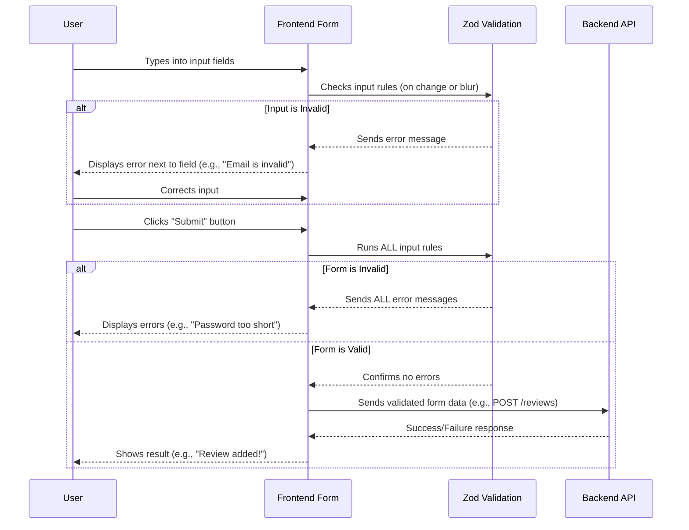

# Chapter 4: Frontend Form Handling & Validation

Welcome back to `book-world`! In our [previous chapter](03_review___comment_system_.md), we learned how users can share their thoughts by writing reviews and comments. But before those thoughts can be saved, we need to make sure they're clear, complete, and correct! This is where "Frontend Form Handling & Validation" comes in.

Imagine you're trying to add a new book or write a review, but you accidentally leave out the title, or type "abc" instead of an email address. Without a helpful assistant, this bad information might get sent to the `book-world` servers, causing errors or saving incomplete data.

This chapter's focus is like having that helpful assistant right there in your web browser. This assistant checks your "paperwork" (the forms you fill out) _before_ it's sent to the server. It ensures that the data you enter meets specific criteria—for example, an email must look like an email, a password needs a certain length, or a review can't be empty. If something's wrong, it tells you immediately, so you can fix it right away without waiting for the server to respond.

## What is a Form?

At its simplest, a **Form** is a set of input fields where you (the user) provide information. In `book-world`, you've seen forms for:

- **Sign Up**: Entering your name, email, and password.
- **Login**: Typing your email and password.
- **Add Book**: Inputting a book's title, author, description, and image.
- **Write a Review**: Providing your thoughts and a star rating.
- **Add a Comment**: Typing your reply.

## What is Form Handling?

**Form Handling** is the process of managing all these input fields on the frontend. It includes:

1.  **Collecting Data**: Gathering what you type into each box.
2.  **Tracking Changes**: Knowing when you type something new.
3.  **Displaying Errors**: Showing messages if something is wrong.
4.  **Submission**: Sending the collected, validated data to the backend.

## What is Validation?

**Validation** is the set of rules that checks if the data you entered is acceptable. It ensures data quality and helps prevent mistakes.

Here are some common validation rules:

- **Required Fields**: Is a field empty when it shouldn't be? (e.g., a book must have a title).
- **Minimum/Maximum Length**: Is a password long enough? Is a review too short or too long?
- **Format Checks**: Is an email in the correct `name@example.com` format? Is a year a valid number?
- **Range Checks**: Is a star rating between 1 and 5?

### Why Frontend Validation?

- **Instant Feedback**: You know immediately if you made a mistake, without waiting for the server. This makes for a much smoother experience!
- **Reduced Server Load**: Only valid data is sent to the server, saving resources.

It's important to remember that **backend validation is still crucial** for security, as frontend validation can be bypassed. However, frontend validation greatly enhances the user experience.

## Central Use Case: Submitting a Review with Validation

Let's focus on our "Write a Review" form from the [previous chapter](03_review___comment_system_.md). We want to make sure:

1.  The review `content` is not empty.
2.  The `rating` is between 1 and 5 stars.

`book-world` uses two main tools for frontend form handling and validation:

- **`react-hook-form`**: A popular library to manage forms in React applications. It helps collect input, handle submission, and display errors easily.
- **`Zod`**: A powerful library for defining validation rules (called "schemas") for your data. It's like writing down all the "correctness rules" for your form.
- **`@hookform/resolvers/zod`**: This acts as a bridge, connecting `react-hook-form` with `Zod`.

### How `ReviewForm` Uses Validation

Let's look at a simplified version of the `ReviewForm.jsx` from `book-world-main/frontend/src/components/ReviewForm.jsx`.

```javascript
// From: book-world-main/frontend/src/components/ReviewForm.jsx
import { useForm } from "react-hook-form";
import { zodResolver } from "@hookform/resolvers/zod";
import { reviewSchema } from "@/schema"; // Our validation rules

const ReviewForm = ({ book, handleUserReply }) => {
  // 1. Setup the form with validation rules
  const form = useForm({
    resolver: zodResolver(reviewSchema), // Connects form to Zod rules
    defaultValues: {
      content: "",
      rating: 0,
    },
  });

  // 2. What happens when the form is submitted
  const onSubmit = (values) => {
    // 'values' here will ONLY contain data that passed validation!
    console.log("Validated form data:", values);
    // ... Now send 'values' to the backend using axios.post ...
    // (See Chapter 5: API Communication for more details on axios)
  };

  return (
    // 3. Link the form to react-hook-form's handleSubmit
    <form onSubmit={form.handleSubmit(onSubmit)}>
      {/* Input fields for Rating and Content */}
      <button type="submit">Submit Review</button>
    </form>
  );
};
```

**Explanation:**

- `useForm`: This is the main "hook" from `react-hook-form`. It initializes our form.
- `resolver: zodResolver(reviewSchema)`: This line is super important! It tells `react-hook-form` to use our `reviewSchema` (defined with Zod) to validate the form data automatically when the user tries to submit.
- `form.handleSubmit(onSubmit)`: This function wraps our `onSubmit` logic. `react-hook-form` will first run the validation rules. If all rules pass, _then_ it calls `onSubmit` with the clean, validated `values`. If not, it stops and tells us what's wrong.

### Defining Validation Rules with Zod Schema

Our validation rules for reviews are defined in `book-world-main/frontend/src/schema.js`. This is where `Zod` comes in.

```javascript
// From: book-world-main/frontend/src/schema.js
import { z } from "zod";

export const reviewSchema = z.object({
  content: z
    .string() // Expects a string
    .trim() // Removes spaces from start/end
    .min(1, { message: "Review cannot be empty" }), // Must have at least 1 character
  rating: z.preprocess(
    // For numerical input, ensure it's a number
    (value) => (isNaN(value) ? 0 : value), // If not a number, make it 0
    z.coerce.number().int().gte(1).lte(5) // Must be an integer between 1 and 5
  ),
});

// Example of another schema for user signup
export const userSchema = z.object({
  firstName: z.string().min(1, "First name is required"),
  lastName: z.string().min(1, "Last name is required"),
  email: z.string().email("Invalid email address"), // Built-in email validation
  password: z.string().min(8, "Password must be at least 8 characters long"),
});
```

**Explanation:**

- `z.object({...})`: This defines an object (like our review or user data) with different fields.
- `z.string()`: Expects the input to be text.
- `.min(1, { message: "..." })`: A rule saying the string must have at least 1 character. If not, it shows the custom message.
- `z.preprocess(...)`: This is a bit advanced, but for `rating`, it first tries to convert whatever the user types into a number. If it's not a number (e.g., "abc"), it defaults to `0`.
- `z.coerce.number().int().gte(1).lte(5)`: After converting to a number, this ensures it's an integer (`int`) and is greater than or equal to 1 (`gte`) and less than or equal to 5 (`lte`).

`book-world` defines similar schemas for `loginSchema` (for the login form) and `bookSchema` (for adding/editing books, which even includes validation for file size and type for images!). This centralizes all the validation rules, making them reusable and easy to understand.

### Displaying Validation Messages (UI Components)

`book-world` uses special `Form` components (like `FormField`, `FormLabel`, `FormControl`, `FormMessage`) which are built on top of `react-hook-form`. These components automatically connect to the validation system and display error messages next to the input fields when something is wrong.

```javascript
// From: book-world-main/frontend/src/components/ReviewForm.jsx
// ... (inside the <form> element) ...
<FormField
  control={form.control} // Tells FormField which form this belongs to
  name="content" // The name of the field (matches schema)
  render={(
    { field } // 'field' contains helpers for input
  ) => (
    <FormItem className="space-y-1">
      <FormLabel className="text-left text-lg">Leave a Review</FormLabel>
      <FormControl>
        <Textarea
          placeholder="Write a brief review of the book..."
          {...field} // Connects the textarea to react-hook-form
        />
      </FormControl>
      <FormMessage /> {/* This component AUTOMATICALLY displays errors! */}
    </FormItem>
  )}
/>
// ...
```

**Explanation:**

- `FormField`: This component acts as a container for each input field.
- `name="content"`: It links this input field to the `content` rule in our `reviewSchema`.
- `FormMessage`: This is the magic component. Because it's inside a `FormField`, it _automatically_ knows if there's an error for the `content` field (from `react-hook-form`'s `formState.errors`) and displays the correct message from our Zod schema (e.g., "Review cannot be empty").

## Under the Hood: How Frontend Form Validation Works

Let's trace the steps when you interact with a form in `book-world`.



1.  **User Enters Data**: You start typing in the form fields.
2.  **Instant Validation**: As you type or move between fields, `react-hook-form` (using `zodResolver`) might run validation rules for that specific field. If you type an invalid email, you'll see an error message right away, even before you click submit!
3.  **Submit Button Clicked**: When you click the "Submit" button, `react-hook-form` takes all the data from the form.
4.  **Full Form Validation**: It then passes this complete set of data to `zodResolver`, which checks _all_ the rules defined in the Zod schema (e.g., `reviewSchema`).
5.  **Errors Displayed**: If any rules are broken, `react-hook-form` updates its internal `errors` state. Our `FormMessage` components then automatically pick up these errors and display them next to the corresponding fields. The form submission is stopped.
6.  **Data Sent to Backend**: If _all_ rules pass, `react-hook-form` calls your `onSubmit` function with the clean, validated data. This data is then ready to be sent to the `Backend API` (which we'll cover in [Chapter 5: API Communication (Axios)](05_api_communication__axios__.md)).

## Other Form Examples in `book-world`

The same principles of `react-hook-form` and `Zod` are used across all forms in `book-world`, ensuring a consistent and reliable user experience.

| Form Page     | File Path                         | Zod Schema Used | Key Validation Rules                                                                                     |
| :------------ | :-------------------------------- | :-------------- | :------------------------------------------------------------------------------------------------------- |
| **Sign Up**   | `frontend/src/pages/Signup.jsx`   | `userSchema`    | First/Last Name (required), Email (format), Password (min 8 chars)                                       |
| **Login**     | `frontend/src/pages/Login.jsx`    | `loginSchema`   | Email (format), Password (min 8 chars)                                                                   |
| **Add Book**  | `frontend/src/pages/AddBook.jsx`  | `bookSchema`    | Title (required), Author (min 3 chars), Genre (at least 1), Year (number, range), Image (file size/type) |
| **Edit Book** | `frontend/src/pages/EditBook.jsx` | `bookSchema`    | Same as Add Book (reuses the schema!)                                                                    |

This table highlights how `book-world` reuses the same validation logic and tools across different parts of the application, making it efficient and easy to maintain. Notice how the `bookSchema` is used for both adding and editing books, demonstrating the power of reusable validation rules.

## Conclusion

In this chapter, you've learned about the vital role of "Frontend Form Handling & Validation" in `book-world`:

- It ensures that user input is **correct and complete** before it even leaves your browser.
- It provides **instant feedback** to the user, making forms easy to fill out.
- `book-world` achieves this with `react-hook-form` for managing form state and `Zod` for defining powerful validation rules.

By setting up these robust frontend checks, `book-world` ensures a smooth and error-free experience for users interacting with its forms.

Next, we'll dive into how the frontend actually _sends_ all this validated data to the backend, and how it handles the responses, in [Chapter 5: API Communication (Axios)](05_api_communication__axios__.md).

---

<sub><sup>Generated by [AI Codebase Knowledge Builder](https://github.com/The-Pocket/Tutorial-Codebase-Knowledge).</sup></sub> <sub><sup>**References**: [[1]](https://github.com/Manoj10211021/book-world/blob/b03e43c9da8c776fde0894d0423c8f8ef785bb9b/book-world-main/frontend/src/components/ReviewForm.jsx), [[2]](https://github.com/Manoj10211021/book-world/blob/b03e43c9da8c776fde0894d0423c8f8ef785bb9b/book-world-main/frontend/src/components/SelectGenreCombobox.jsx), [[3]](https://github.com/Manoj10211021/book-world/blob/b03e43c9da8c776fde0894d0423c8f8ef785bb9b/book-world-main/frontend/src/components/ui/form.jsx), [[4]](https://github.com/Manoj10211021/book-world/blob/b03e43c9da8c776fde0894d0423c8f8ef785bb9b/book-world-main/frontend/src/pages/AddBook.jsx), [[5]](https://github.com/Manoj10211021/book-world/blob/b03e43c9da8c776fde0894d0423c8f8ef785bb9b/book-world-main/frontend/src/pages/EditBook.jsx), [[6]](https://github.com/Manoj10211021/book-world/blob/b03e43c9da8c776fde0894d0423c8f8ef785bb9b/book-world-main/frontend/src/pages/Login.jsx), [[7]](https://github.com/Manoj10211021/book-world/blob/b03e43c9da8c776fde0894d0423c8f8ef785bb9b/book-world-main/frontend/src/pages/Signup.jsx), [[8]](https://github.com/Manoj10211021/book-world/blob/b03e43c9da8c776fde0894d0423c8f8ef785bb9b/book-world-main/frontend/src/schema.js), [[9]](https://github.com/Manoj10211021/book-world/blob/b03e43c9da8c776fde0894d0423c8f8ef785bb9b/tests/frontend/components/ReviewForm.test.jsx)</sup></sub>
