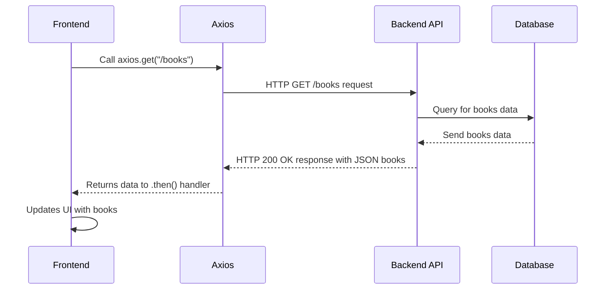

# Chapter 5: API Communication (Axios)

Welcome back, `book-world` explorer! In our [previous chapter](04_frontend_form_handling___validation_.md), we became experts at handling forms on the frontend, ensuring that all the information you type (like a book's title or your review) is neat, complete, and correct _before_ it leaves your browser.

Now that our forms are polished and ready, a new question arises: How do we actually _send_ this perfectly validated data to the backend server where it can be stored? And how do we _get_ data from the backend to display on our pages, like the list of all books on the homepage?

This is where **API Communication** comes in. Think of it like sending and receiving letters. The "API" (Application Programming Interface) is the official post office, and **Axios** is our dedicated, super-reliable mail carrier. Axios handles all the tricky bits of packaging your data into requests, sending them securely over the internet to the backend, and then bringing back the responses (like the list of books or a "review saved successfully" message). It ensures information flows smoothly and reliably between your browser (frontend) and the server (backend).

## What is API Communication?

In the world of `book-world`, **API communication** is simply how the frontend (what you see in your browser) talks to the backend (where the data is stored and processed).

It involves:

1.  **Sending Requests**: The frontend asks the backend for something (e.g., "Give me all the books," "Save this new review," "Log me in").
2.  **Receiving Responses**: The backend answers that request (e.g., sends the list of books, confirms the review was saved, provides a login token).

These requests and responses use standard internet rules called **HTTP methods**:

- **GET**: To _get_ (read) data (like fetching all books).
- **POST**: To _create_ new data (like adding a new book or review).
- **PUT/PATCH**: To _update_ existing data (like editing a book or review).
- **DELETE**: To _remove_ data (like deleting a book or comment).

## Why Axios?

While web browsers have built-in ways to send requests (like `fetch`), Axios is a popular **JavaScript library** that makes API communication much easier and more powerful. It's like upgrading from sending your own mail to having a professional courier service.

Here's why `book-world` uses Axios:

- **Simplicity**: It provides a clean, easy-to-understand way to send different types of requests.
- **Automatic JSON Handling**: It automatically converts your JavaScript objects into JSON (a standard data format for web communication) when sending, and converts JSON responses back into JavaScript objects when receiving.
- **Error Handling**: It makes it straightforward to catch and deal with errors that might happen during communication (e.g., network issues, server errors).
- **Interceptor Support**: It allows you to "intercept" requests or responses globally to add common logic (like attaching authentication tokens).

## Central Use Case: Fetching Books for the Homepage

Let's revisit a familiar scenario from [Chapter 1: Book Data Model & API](01_book_data_model___api_.md): displaying all books on the homepage. How does the frontend use Axios to get this list from the backend?

The `useBooks` hook in `book-world` is responsible for this.

```javascript
// From: book-world-main/frontend/src/hooks/useBooks.js
import axios from "axios"; // Our mail carrier!
import { useEffect, useState } from "react";

const useBooks = (genre) => {
  const [books, setBooks] = useState([]);
  const [isLoading, setIsLoading] = useState(false);

  useEffect(() => {
    setIsLoading(true); // Start loading animation
    // 1. Tell Axios to make a GET request
    axios
      .get(`${import.meta.env.VITE_BACKEND_URL}/books`, {
        params: { q: genre || "" }, // Optional: send a search query
      })
      .then((response) => {
        // 2. If successful, put the books into our state
        setBooks(response.data.books);
      })
      .catch((err) => {
        // 3. If there's an error, show a message
        console.error("Error fetching books:", err);
      })
      .finally(() => setIsLoading(false)); // Always stop loading
  }, [genre]); // Re-run if genre changes

  return { books, isLoading };
};
```

**Explanation:**

1.  **`axios.get(...)`**: This tells Axios to make a `GET` request. The first argument is the URL of the API endpoint we want to talk to (e.g., `http://localhost:8000/books`). `import.meta.env.VITE_BACKEND_URL` is just a way to get the address of our backend server without hardcoding it.
2.  **`.then((response) => {...})`**: If the request is successful, the backend sends back a `response`. This `response` object contains the data from the server (like the list of books) in `response.data`. We then take `response.data.books` and save it to our `books` state so it can be displayed.
3.  **`.catch((err) => {...})`**: If anything goes wrong (e.g., network disconnected, server error), the `.catch()` block runs. This is where we handle errors, perhaps by showing an error message to the user.
4.  **`.finally(() => {...})`**: This block always runs, whether the request succeeded or failed. It's a good place to stop loading indicators.

## Central Use Case: Submitting a Review

Now let's look at sending data _to_ the backend. When you write a review using the form we discussed in [Chapter 4: Frontend Form Handling & Validation](04_frontend_form_handling___validation_.md), Axios is used to send that review to the server.

```javascript
// From: book-world-main/frontend/src/components/ReviewForm.jsx (Simplified)
import axios from "axios";
// ... other imports ...

const ReviewForm = ({ book }) => {
  // ... react-hook-form setup ...

  const onSubmit = (values) => {
    // 'values' contains { content: "...", rating: 5 }
    // 1. Tell Axios to make a POST request
    axios
      .post(
        `${import.meta.env.VITE_BACKEND_URL}/books/${book._id}/reviews`, // API endpoint URL
        values, // The data to send (review content & rating)
        {
          headers: {
            // 2. Include the Authorization token for security
            Authorization: `Bearer ${localStorage.getItem("token")}`,
          },
        }
      )
      .then((response) => {
        // 3. If successful, show a success message
        console.log(response.data.message); // e.g., "Review created successfully"
      })
      .catch((error) => {
        // 4. If error, show error message
        console.error("Error submitting review:", error);
      });
  };

  return (
    // ... form structure ...
    <form onSubmit={form.handleSubmit(onSubmit)}>
      {/* ... inputs for content and rating ... */}
      <button type="submit">Submit Review</button>
    </form>
  );
};
```

**Explanation:**

1.  **`axios.post(URL, data, config)`**: This tells Axios to make a `POST` request.
    - The first argument is the URL of the review API endpoint, which includes the `book._id` to ensure the review is linked to the correct book.
    - The second argument (`values`) is the data we want to send (your review content and rating). Axios automatically converts this JavaScript object into JSON.
    - The third argument is an optional `config` object. Here, we use it to add `headers`.
2.  **`Authorization` Header**: This is crucial for security, as learned in [Chapter 2: User Management & Authentication](02_user_management___authentication_.md). We attach your **JWT token** (stored in `localStorage`) in the `Authorization` header. This tells the backend _who_ is submitting the review and that they are authorized to do so.
3.  **`.then()` and `.catch()`**: Similar to `GET` requests, these handle success and error responses from the backend.

## Under the Hood: How Axios Communicates

Let's visualize the journey of a request and its response using Axios.



1.  **Frontend Initiates**: Your `book-world` application (Frontend) calls an Axios method like `axios.get` or `axios.post`.
2.  **Axios Prepares**: Axios takes your request details (URL, data, headers) and prepares an actual HTTP request.
3.  **Request Sent**: Axios sends this HTTP request over the internet to the `Backend API` server.
4.  **Backend Processes**: The `Backend API` receives the request, processes it (e.g., queries the `Database` for books, saves a new review), and prepares a response.
5.  **Response Sent**: The `Backend API` sends an HTTP response back to Axios. This response includes a **status code** (like `200 OK` for success, or `401 Unauthorized` for an error) and usually a **JSON payload** (the actual data).
6.  **Axios Processes Response**: Axios receives the HTTP response, checks the status code, and if there's JSON data, it automatically converts it into a JavaScript object.
7.  **Data Returned to Frontend**: Axios then hands over the processed response (or an error) to your `then()` or `catch()` block in the frontend, allowing your code to update the display or show an error.

### Understanding HTTP Status Codes

The backend uses special numbers called **HTTP Status Codes** to tell the frontend what happened with the request. Axios helps us easily check these.

| Code  | Meaning               | Common Scenario in `book-world`                                                                                                   |
| :---- | :-------------------- | :-------------------------------------------------------------------------------------------------------------------------------- |
| `200` | OK / Success          | Book list fetched, review submitted successfully                                                                                  |
| `201` | Created               | A new user account was created                                                                                                    |
| `400` | Bad Request           | You sent incomplete or malformed data                                                                                             |
| `401` | Unauthorized          | You tried to access a protected feature without being logged in or with an invalid token (e.g., adding a book without logging in) |
| `403` | Forbidden             | You are logged in, but don't have permission for this action (e.g., a regular user trying to delete a book)                       |
| `404` | Not Found             | The requested resource doesn't exist (e.g., trying to view a book with a non-existent ID)                                         |
| `500` | Internal Server Error | Something went wrong on the server's side                                                                                         |

When an Axios request fails (e.g., a 4xx or 5xx status code), it throws an error that your `.catch()` block can handle. The `error` object it provides often contains `error.response.data.message` which is the specific error message sent by our backend, making it easy to show helpful messages to the user. This central error handling is something we'll explore further in [Chapter 7: Centralized Error Handling](07_centralized_error_handling_.md).

## Other Places Axios is Used

Axios is the workhorse for almost all frontend-backend communication in `book-world`. Here are just a few more examples:

| Feature                   | HTTP Method | Axios Call Example                                                                          | Purpose                                         |
| :------------------------ | :---------- | :------------------------------------------------------------------------------------------ | :---------------------------------------------- |
| User Login                | `POST`      | `axios.post('/users/login', { email, password })`                                           | Authenticate user, get JWT token                |
| View Favorite Books       | `GET`       | `axios.get('/users/favourites', { headers: { Authorization: 'Bearer ...' } })`              | Fetch books liked by the logged-in user         |
| View All Users (Admin)    | `GET`       | `axios.get('/users/', { headers: { Authorization: 'Bearer ...' } })`                        | Get list of all users (admin-only)              |
| Toggle Book Favorite      | `POST`      | `axios.post('/users/toggle-favourite', { bookId })`                                         | Add/remove book from user's favorites           |
| Adding/Editing a Book     | `POST/PUT`  | `axios.post('/books', newBookData, { headers: { 'Content-Type': 'multipart/form-data' } })` | Create or update book details (with image file) |
| Deleting a Review/Comment | `DELETE`    | `axios.delete('/books/:bookId/reviews/:reviewId')`                                          | Remove specific review/comment                  |
| Liking a Review/Comment   | `POST`      | `axios.post('/reviews/:reviewId/like')`                                                     | Increase like count, track user's likes         |

As you can see, `axios` provides a consistent and powerful way to interact with different parts of our `book-world` API, handling everything from simple data fetches to complex file uploads and authenticated actions.

## Conclusion

In this chapter, you've learned about the fundamental role of **API Communication** in `book-world`, and how **Axios** acts as our reliable messenger:

- **API Communication** is how the frontend and backend talk to each other by sending **requests** and receiving **responses**.
- **Axios** is a powerful JavaScript library that simplifies this process, handling HTTP methods (GET, POST, PUT, DELETE), JSON data, and errors.
- You saw how `book-world` uses Axios to **fetch book lists** for display and **submit user reviews**, always including **authentication tokens** when necessary.
- You gained a basic understanding of **HTTP status codes** and how they signal the outcome of a request.

With Axios in hand, `book-world` can confidently send and receive data, making our application dynamic and interactive.

Next, we'll explore how `book-world` manages and shares important information across different parts of the frontend without constantly re-fetching data, using **Recoil** in [Chapter 6: Frontend Global State (Recoil)](06_frontend_global_state__recoil__.md).

---

<sub><sup>Generated by [AI Codebase Knowledge Builder](https://github.com/The-Pocket/Tutorial-Codebase-Knowledge).</sup></sub> <sub><sup>**References**: [[1]](https://github.com/Manoj10211021/book-world/blob/b03e43c9da8c776fde0894d0423c8f8ef785bb9b/book-world-main/backend/index.js), [[2]](https://github.com/Manoj10211021/book-world/blob/b03e43c9da8c776fde0894d0423c8f8ef785bb9b/book-world-main/frontend/src/hooks/useBooks.js), [[3]](https://github.com/Manoj10211021/book-world/blob/b03e43c9da8c776fde0894d0423c8f8ef785bb9b/book-world-main/frontend/src/hooks/useUserData.js), [[4]](https://github.com/Manoj10211021/book-world/blob/b03e43c9da8c776fde0894d0423c8f8ef785bb9b/book-world-main/frontend/src/pages/FavouriteBooks.jsx), [[5]](https://github.com/Manoj10211021/book-world/blob/b03e43c9da8c776fde0894d0423c8f8ef785bb9b/book-world-main/frontend/src/pages/Login.jsx), [[6]](https://github.com/Manoj10211021/book-world/blob/b03e43c9da8c776fde0894d0423c8f8ef785bb9b/book-world-main/frontend/src/pages/Users.jsx), [[7]](https://github.com/Manoj10211021/book-world/blob/b03e43c9da8c776fde0894d0423c8f8ef785bb9b/tests/frontend/components/ReviewForm.test.jsx), [[8]](https://github.com/Manoj10211021/book-world/blob/b03e43c9da8c776fde0894d0423c8f8ef785bb9b/tests/frontend/hooks/useBooks.test.js), [[9]](https://github.com/Manoj10211021/book-world/blob/b03e43c9da8c776fde0894d0423c8f8ef785bb9b/tests/setup.js)</sup></sub>
