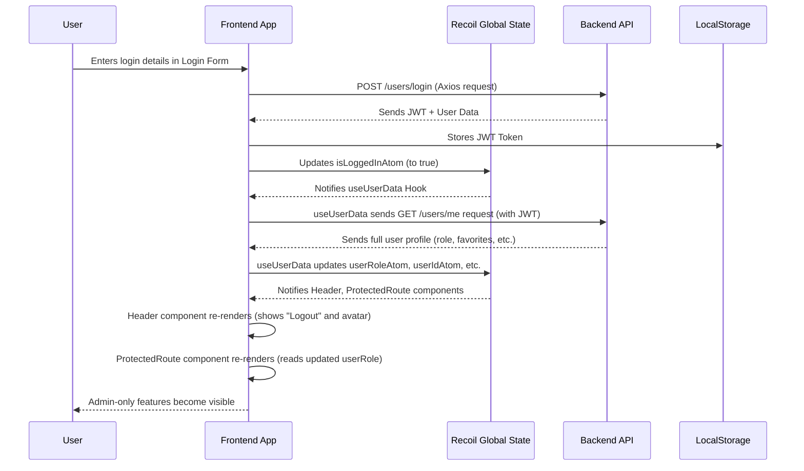

# Chapter 6: Frontend Global State (Recoil)

Welcome back, `book-world` explorer! In our [previous chapter](05_api_communication__axios__.md), we mastered the art of "API Communication" using Axios, learning how our frontend sends requests to and receives responses from the backend. This is how we get book lists, submit reviews, and even log in!

Now, imagine you've just logged into `book-world`. Your browser knows you're logged in, and it received a special "token" (from [Chapter 2: User Management & Authentication](02_user_management___authentication_.md)) that confirms your identity. What happens next?

- The navigation bar needs to change from "Login/Signup" to "Logout" and show your profile picture.
- The "Add Book" button should only appear if you're an "admin" user.
- Your "Favorite Books" page needs to display books you've saved.

All these different parts of the frontend need to know the same information: "Is the user logged in?", "What's their role?", "What are their favorite books?". If each part had to ask the backend separately every time, or if we had to pass this information manually through dozens of components, our app would become slow and messy.

This is where **Frontend Global State** comes in. Think of it like a **central brain or a shared whiteboard** for your entire `book-world` application. Instead of information being scattered or passed around laboriously, all important data (like login status, user role, or favorite books) is stored in one accessible place. Any part of your application can instantly "read" from this whiteboard or "update" it, ensuring everyone is on the same page and the user interface stays consistent and reactive.

`book-world` uses a library called **Recoil** to manage this central brain.

## What is Frontend Global State?

**Frontend Global State** is simply a place in your web application's memory where you store data that needs to be shared across many different parts (components) of your application.

- **Problem it solves**: Avoids "prop drilling" (passing data down through many layers of components) and "state duplication" (different components having their own copies of the same information, leading to inconsistencies).
- **Analogy**: Imagine a team working on a project. Instead of everyone having their own scattered notes, they have one big, shared project board (our "global state"). Anyone can look at it to get the latest info, and anyone can update it, and everyone instantly sees the change.

## Why Recoil?

Recoil is a library specifically designed for managing state in React applications. Here's why `book-world` uses it:

- **Simple & Flexible**: It provides a straightforward way to define and use shared data.
- **Performance**: It's built to be efficient, only updating the parts of your app that _really_ need to change when data updates.
- **React-ish**: It works seamlessly with React's way of building components.

Recoil has two main building blocks:

1.  **Atoms**: These are the smallest, individual pieces of state in your global store.

    - **Analogy**: Think of them as individual sticky notes on our shared whiteboard. Each sticky note holds one piece of information (e.g., "Is User Logged In?", "User's Role").
    - Any component can "subscribe" to an atom, meaning they will automatically get updated whenever that atom's value changes.

2.  **Selectors**: These are like "derived" or "calculated" pieces of state. They take one or more atoms (or other selectors) as input and produce a new value based on them.
    - **Analogy**: Imagine a smart display on our whiteboard that automatically shows "Welcome Admin!" if the "User Role" sticky note says "admin." The display doesn't store its own data; it just _calculates_ what to show based on other sticky notes.

## Central Use Case: Managing User Login and Data

In `book-world`, one of the most important pieces of global state is information about the currently logged-in user. This includes:

- Whether they are logged in (`isLoggedIn`)
- Their role (`userRole` - "user" or "admin")
- Their unique ID (`userId`)
- Their profile picture (`userAvatar`)
- Lists of things they've liked or favorited (`usersFavouriteBooks`, `likedReviews`, `likedComments`)
- If user data is currently loading (`isUserLoading`)

Let's see how `book-world` uses Recoil to manage this crucial information.

### 1. Defining Our Global Data "Sticky Notes" (Atoms)

We define our individual pieces of global state using `atom()` in `book-world-main/frontend/src/atoms/userData.jsx`.

```javascript
// From: book-world-main/frontend/src/atoms/userData.jsx
import { atom, selector } from "recoil"; // Import atom and selector

export const userRoleAtom = atom({
  key: "userRole", // Unique name for this atom
  default: "", // Default value when no user is logged in
});

export const userIdAtom = atom({
  key: "userId",
  default: "",
});

export const isLoggedInAtom = atom({
  key: "isLoggedIn",
  // Check localStorage for a token to determine initial login state
  default: !!localStorage.getItem("token"),
});

export const usersFavouriteBooksAtom = atom({
  key: "usersFavouriteBooks",
  default: [], // An empty list by default
});

export const isUserLoadingAtom = atom({
  key: "isUserLoading",
  default: false, // Initially, we are not loading user data
});
// ... other atoms for likedReviewsAtom, likedCommentsAtom
```

**Explanation:**

- Each `atom` has a `key` (a unique identifier) and a `default` value.
- `isLoggedInAtom` cleverly checks `localStorage.getItem("token")` to see if a token exists from a previous login. If it does, `!!` converts it to `true`, making the user appear logged in right away when the app starts.

### 2. Smart Display for User Avatar (Selector)

The user's avatar is a good example of a `selector`. If a user has a custom picture, we use that. If not, we generate a default one based on their `userId`.

```javascript
// From: book-world-main/frontend/src/atoms/userData.jsx
// ... (above code for atoms) ...
import multiavatar from "@multiavatar/multiavatar"; // For generating default avatars

export const userAvatarAtom = atom({
  key: "userAvatarAtom",
  default: "", // Default to empty, selector will provide initial
});

export const userAvatarSelector = selector({
  key: "userAvatarSelector",
  get: ({ get }) => {
    // 'get' function allows reading other atoms/selectors
    const currentAvatar = get(userAvatarAtom);
    if (currentAvatar) {
      return currentAvatar; // If a specific avatar is set, use it
    }
    const userId = get(userIdAtom); // Get the user ID from userIdAtom
    const svgCode = multiavatar(userId); // Generate an SVG avatar
    return `data:image/svg+xml;base64,${btoa(svgCode)}`; // Return as data URL
  },
  set: ({ set, get }, newValue) => {
    // 'set' function allows updating atoms
    if (!newValue) {
      // If setting to empty, generate default based on userId
      const userId = get(userIdAtom);
      const svgCode = multiavatar(userId);
      const defaultAvatar = `data:image/svg+xml;base64,${btoa(svgCode)}`;
      set(userAvatarAtom, defaultAvatar);
    } else {
      // Otherwise, set the provided new value
      set(userAvatarAtom, newValue);
    }
  },
});
```

**Explanation:**

- `userAvatarSelector` depends on `userAvatarAtom` and `userIdAtom`.
- The `get` function defines how its value is calculated: If `userAvatarAtom` has a value, use it. Otherwise, generate an avatar using `multiavatar` based on `userIdAtom`.
- The `set` function defines how to update the underlying `userAvatarAtom` when `userAvatarSelector` is "set." If a `newValue` is provided, it sets it. If `newValue` is empty, it generates and sets a _default_ avatar.

### 3. Connecting to the "Central Brain" (Hooks)

Components or other hooks in `book-world` use special Recoil hooks to interact with atoms and selectors:

- `useRecoilState(myAtom)`: Allows a component to **read** the current value of an atom _and_ **update** it. If the atom changes, the component will re-render.
- `useRecoilValue(myAtomOrSelector)`: Allows a component to **read** the current value of an atom or selector. If the value changes, the component will re-render.
- `useSetRecoilState(myAtom)`: Allows a component to **update** an atom without needing to read its current value.

The `useUserData` hook (in `book-world-main/frontend/src/hooks/useUserData.js`) is central to populating our global user state. It runs when the app starts or when the login status changes.

```javascript
// From: book-world-main/frontend/src/hooks/useUserData.js (Simplified)
import { useEffect } from "react";
import axios from "axios"; // For API communication (Chapter 5)
import { useSetRecoilState, useRecoilState } from "recoil";
import {
  isLoggedInAtom,
  userRoleAtom,
  userIdAtom,
  usersFavouriteBooksAtom,
  likedReviewsAtom,
  likedCommentsAtom,
  userAvatarSelector,
  isUserLoadingAtom,
} from "@/atoms/userData"; // Our defined atoms and selectors

const useUserData = () => {
  // Use useSetRecoilState to get functions to update specific atoms
  const setUserRole = useSetRecoilState(userRoleAtom);
  const setUserId = useSetRecoilState(userIdAtom);
  const setUsersFavouriteBooks = useSetRecoilState(usersFavouriteBooksAtom);
  const setLikedReviews = useSetRecoilState(likedReviewsAtom);
  const setLikedComments = useSetRecoilState(likedCommentsAtom);
  const setIsUserLoading = useSetRecoilState(isUserLoadingAtom);
  const setUserAvatar = useSetRecoilState(userAvatarSelector); // Update the selector
  // Use useRecoilState to read and update isLoggedInAtom
  const [isLoggedIn, setIsLoggedIn] = useRecoilState(isLoggedInAtom);

  const fetchUser = async () => {
    setIsUserLoading(true); // Set loading state to true
    axios
      .get(`${import.meta.env.VITE_BACKEND_URL}/users/me`, {
        // Fetch user data from backend (Chapter 2)
        headers: {
          Authorization: `Bearer ${localStorage.getItem("token")}`, // Send JWT
        },
      })
      .then((response) => {
        // Update our Recoil atoms with data from the backend!
        setUserRole(response.data.user.role);
        setUserId(response.data.user._id);
        setUserAvatar(response.data.user.picture || "");
        setIsLoggedIn(true);
        setUsersFavouriteBooks(response.data.user.favoriteBooks || []);
        setLikedReviews(response.data.user.likedReviews || []);
        setLikedComments(response.data.user.likedComments || []);
      })
      .catch((error) => {
        // If fetch fails (e.g., token expired), log user out and clear state
        localStorage.removeItem("token");
        setIsLoggedIn(false);
        console.error(
          "Error fetching user data:",
          error.response?.data?.message || error.message
        );
      })
      .finally(() => setIsUserLoading(false)); // Always set loading to false
  };

  useEffect(() => {
    if (localStorage.getItem("token")) {
      // Only fetch if a token exists
      fetchUser();
    } else {
      // If no token, ensure all user-related state is cleared
      setIsLoggedIn(false);
      setUserRole("");
      setUserId("");
      setUserAvatar("");
      setUsersFavouriteBooks([]);
      setLikedReviews([]);
      setLikedComments([]);
      setIsUserLoading(false);
    }
  }, [isLoggedIn]); // Re-run this effect when isLoggedIn changes (e.g., after login/logout)

  return [isLoggedIn, setIsLoggedIn];
};

export default useUserData;
```

**Explanation:**

- This hook uses `useEffect` to run `fetchUser` when the component first loads or when `isLoggedIn` changes.
- `fetchUser` makes an Axios `GET` request to the `/users/me` endpoint (from [Chapter 2: User Management & Authentication](02_user_management___authentication_.md)), sending the JWT token.
- When the backend responds with user data, the hook uses `useSetRecoilState` (e.g., `setUserRole`, `setUserId`) to **update the respective Recoil atoms**. This is how the backend data gets into our "central brain."
- If the request fails (e.g., invalid token), it clears `localStorage` and sets `isLoggedIn` to `false`, effectively logging the user out from the frontend's perspective.

### 4. Making the Whole App Aware (`RecoilRoot`)

For Recoil to work, your entire application (or the part of it that needs global state) must be wrapped in a `<RecoilRoot>`. Think of `RecoilRoot` as the actual "whiteboard" container.

In `book-world-main/frontend/src/main.jsx`:

```javascript
// From: book-world-main/frontend/src/main.jsx
// ... other imports ...
import { RecoilRoot } from "recoil"; // Import RecoilRoot

ReactDOM.createRoot(document.getElementById("root")).render(
  // ... other providers like ThemeProvider, GoogleOAuthProvider ...
  <RecoilRoot>
    {" "}
    {/* This wraps our entire application */}
    <Toaster /> {/* For showing toast messages */}
    <RouterProvider router={router} /> {/* Our application's routes */}
  </RecoilRoot>
  // ...
);
```

**Explanation:**

- By placing `<RecoilRoot>` high up in our application's component tree, we make sure that any component deeper down can access our Recoil atoms and selectors.

### 5. Using Global State in Components (Examples)

Now that our global state is set up and populated, different components can _read_ this data to adapt their behavior.

**Example 1: Showing / Hiding Admin Features**

The `AddBook` and `EditBook` pages (and the "Users" page) are only accessible to "admin" users. `book-world` uses a `ProtectedRoute` component to handle this based on the `userRoleAtom`.

```javascript
// From: book-world-main/frontend/src/main.jsx (Simplified)
import { Navigate } from "react-router-dom";
import { useRecoilValue } from "recoil"; // For reading global state
import {
  isLoggedInAtom,
  isUserLoadingAtom,
  userRoleAtom,
} from "./atoms/userData"; // Our atoms

const ProtectedRoute = ({ children, roles }) => {
  const userRole = useRecoilValue(userRoleAtom); // Read current user role
  const isLoading = useRecoilValue(isUserLoadingAtom); // Check if user data is loading
  const isLoggedIn = useRecoilValue(isLoggedInAtom); // Check login status

  if (isLoading) {
    return <div>Loading user permissions...</div>; // Show loading if data not ready
  }

  // If not logged in OR role is not allowed, redirect to login page
  if (!isLoggedIn || !roles.includes(userRole)) {
    return <Navigate to="/login" replace />;
  }

  return children; // If authorized, render the protected content
};

const router = createBrowserRouter([
  {
    path: "/books/add",
    element: (
      <ProtectedRoute roles={["admin"]}>
        {" "}
        {/* Only admins can access this route */}
        {/* The AddBook component will be rendered here if user is admin */}
        {/* <AddBook /> */}
      </ProtectedRoute>
    ),
  },
  {
    path: "/favourites",
    element: (
      <ProtectedRoute roles={["user", "admin"]}>
        {" "}
        {/* Both users and admins can access */}
        {/* <FavouriteBooks /> */}
      </ProtectedRoute>
    ),
  },
  // ... other routes
]);
```

**Explanation:**

- `ProtectedRoute` uses `useRecoilValue` to read `userRoleAtom`, `isLoggedInAtom`, and `isUserLoadingAtom`.
- It first checks `isLoading` to prevent redirecting before user data is fetched.
- Then, it checks if the user is `isLoggedIn` and if their `userRole` is included in the `roles` array allowed for that route.
- If not authorized, it uses `Navigate` (from `react-router-dom`) to redirect the user to the login page.
- If authorized, it renders the `children` (the actual page component like `AddBook`).

**Example 2: Dynamic Header/Navigation**

While not shown in full code, components like the `Header` (`book-world-main/frontend/src/components/Header.jsx`) would similarly use `useRecoilValue(isLoggedInAtom)` and `useRecoilValue(userAvatarSelector)` to decide whether to show "Login/Signup" buttons or "Logout" and the user's avatar.

```javascript
// Conceptual example for Header component
import { useRecoilValue } from "recoil";
import { isLoggedInAtom, userAvatarSelector } from "@/atoms/userData";

const Header = () => {
  const isLoggedIn = useRecoilValue(isLoggedInAtom);
  const userAvatar = useRecoilValue(userAvatarSelector);

  return (
    <header>
      {/* ... other header content ... */}
      {isLoggedIn ? (
        <>
          
          <button>Logout</button>
        </>
      ) : (
        <>
          <button>Login</button>
          <button>Signup</button>
        </>
      )}
    </header>
  );
};
```

**Explanation:**

- By reading `isLoggedInAtom`, the `Header` instantly knows if it should display login/signup options or logout options.
- It also uses `userAvatarSelector` to display the correct profile picture for the logged-in user. Any change to the `userAvatarAtom` or `userIdAtom` would automatically cause this `Header` component to update with the new avatar.

## Under the Hood: The Flow of Global State

Let's trace how global state works from login to showing protected pages.



**Explanation of Flow:**

1.  **User Logs In**: You type your details into the `LoginForm` and submit.
2.  **Axios Request**: The `LoginForm` (using Axios) sends a `POST` request to the `Backend API`'s login endpoint.
3.  **Backend Responds**: The `Backend API` verifies credentials and sends back a **JWT token** and basic user data.
4.  **Store Token**: The `Frontend App` saves the `JWT token` in `localStorage` (for persistence across browser sessions).
5.  **Update `isLoggedIn` Atom**: The `LoginForm` also updates the `isLoggedInAtom` in `Recoil Global State` to `true`.
6.  **`useUserData` Reacts**: Because `useUserData` (which is always active in the `App` component) watches `isLoggedInAtom`, it detects the change and triggers its `useEffect`.
7.  **Fetch Full User Data**: `useUserData` then makes another Axios `GET` request to the `/users/me` endpoint, sending the JWT token from `localStorage`.
8.  **Backend Sends User Profile**: The `Backend API` verifies the token and sends back the complete user profile (including `role`, `favoriteBooks`, `picture`).
9.  **Update Other Recoil Atoms**: `useUserData` receives this profile and updates all relevant Recoil atoms (`userRoleAtom`, `userIdAtom`, `userAvatarSelector`, `usersFavouriteBooksAtom`, etc.) in `Recoil Global State`.
10. **Components Re-render**: Any component subscribed to these atoms (like the `Header` or `ProtectedRoute`) automatically receives the new data and re-renders itself.
11. **UI Updates**: The `Header` instantly shows "Logout" and your avatar. The `ProtectedRoute` now has your `userRole` and can decide whether to grant access to pages like "Add Book."

## Conclusion

In this chapter, you've learned about the power of **Frontend Global State** in `book-world` and how **Recoil** helps manage it:

- **Problem Solved**: Global state centralizes important data, avoiding messy data passing and ensuring consistency across your entire application.
- **Recoil's Role**: It provides simple, efficient tools (atoms and selectors) to define and interact with this shared data.
- **User Data Management**: You saw how `book-world` uses Recoil to store crucial user information like login status, role, and favorites, making it accessible to any component.
- **Dynamic UI**: This allows `book-world` to dynamically change what's displayed (like navigation links) and control access to specific pages (like admin-only features) based on the user's current status, all from one central source of truth.

You now have a solid understanding of how `book-world` keeps its frontend components informed and synchronized.

Next, we'll dive into how `book-world` handles errors that might occur during API communication or other parts of the application, ensuring a robust user experience, in [Chapter 7: Centralized Error Handling](07_centralized_error_handling_.md).

---

<sub><sup>Generated by [AI Codebase Knowledge Builder](https://github.com/The-Pocket/Tutorial-Codebase-Knowledge).</sup></sub> <sub><sup>**References**: [[1]](https://github.com/Manoj10211021/book-world/blob/b03e43c9da8c776fde0894d0423c8f8ef785bb9b/book-world-main/frontend/src/atoms/meta.jsx), [[2]](https://github.com/Manoj10211021/book-world/blob/b03e43c9da8c776fde0894d0423c8f8ef785bb9b/book-world-main/frontend/src/atoms/userData.jsx), [[3]](https://github.com/Manoj10211021/book-world/blob/b03e43c9da8c776fde0894d0423c8f8ef785bb9b/book-world-main/frontend/src/hooks/useUserData.js), [[4]](https://github.com/Manoj10211021/book-world/blob/b03e43c9da8c776fde0894d0423c8f8ef785bb9b/book-world-main/frontend/src/main.jsx), [[5]](https://github.com/Manoj10211021/book-world/blob/b03e43c9da8c776fde0894d0423c8f8ef785bb9b/book-world-main/frontend/src/pages/App.jsx), [[6]](https://github.com/Manoj10211021/book-world/blob/b03e43c9da8c776fde0894d0423c8f8ef785bb9b/tests/frontend/hooks/useBooks.test.js), [[7]](https://github.com/Manoj10211021/book-world/blob/b03e43c9da8c776fde0894d0423c8f8ef785bb9b/tests/setup.js)</sup></sub>
