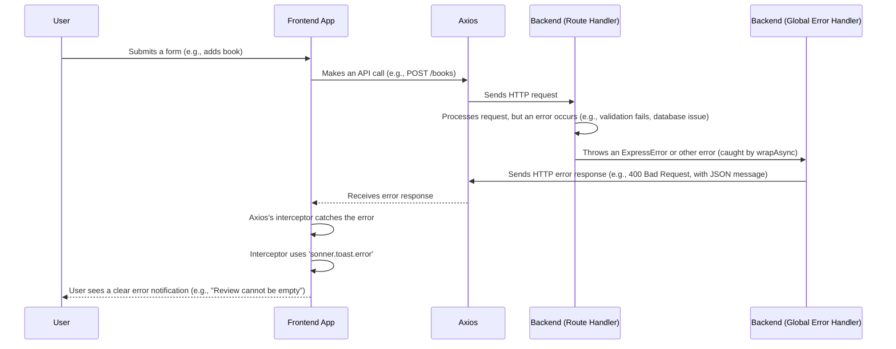

# Chapter 7: Centralized Error Handling

Welcome back to `book-world`! In our [previous chapter](06_frontend_global_state__recoil__.md), we explored how `book-world` uses Recoil to manage and share important information across the frontend, like whether a user is logged in or what their role is. This helps our app stay organized and reactive.

But what happens when something goes wrong? What if the internet connection suddenly drops? What if a user tries to add a book with an invalid year? Or what if our server encounters an unexpected issue while processing a request?

Without a proper plan, these "unexpected issues" can lead to:

- Confusing or blank screens for the user.
- The application crashing.
- Inconsistent error messages (or no messages at all!).

This is where **Centralized Error Handling** comes in. Imagine it as a sophisticated "safety net" for our entire `book-world` application. Instead of each little part of the app trying to deal with problems on its own, all errors are caught and managed in one consistent way. This ensures that whether an issue occurs in your browser (frontend) or on the server (backend), the application responds gracefully, shows clear messages, and prevents crashes, offering a much smoother experience for everyone.

## What is an Error?

At its simplest, an **Error** is an unexpected problem or issue that prevents a part of our application from working as intended.

In `book-world`, errors can broadly occur in two places:

1.  **Frontend Errors**: These happen in your web browser. Examples include:
    - **Network Issues**: Your internet connection drops, and the app can't talk to the server.
    - **Invalid User Input**: You try to submit a form with missing or incorrect information (though we primarily catch these with validation, as seen in [Chapter 4: Frontend Form Handling & Validation](04_frontend_form_handling___validation_.md)).
    - **Unexpected UI Problems**: A piece of code trying to display something fails.
2.  **Backend Errors**: These happen on our server. Examples include:
    - **Database Problems**: The server can't connect to the database or save data correctly.
    - **Authorization Failures**: A user tries to do something they don't have permission for (e.g., a regular user trying to delete a book, as discussed in [Chapter 2: User Management & Authentication](02_user_management___authentication_.md)).
    - **Logical Bugs**: A piece of server code contains a mistake that causes it to fail unexpectedly.

## Why Centralize Error Handling?

The main goal of centralized error handling is **consistency and robustness**.

- **Consistent Feedback**: No matter what goes wrong, the user gets a clear, understandable message.
- **Prevent Crashes**: Errors are "caught" before they break the entire application.
- **Easier Maintenance**: Developers have one place to manage how errors are handled, making it simpler to update or debug.

Let's see how `book-world` implements this safety net on both the frontend and backend.

## Frontend Centralized Error Handling

On the frontend, the main goal is to show the user a helpful message when an API request fails, without cluttering every single API call with `try...catch` blocks.

`book-world` uses `sonner` (a simple toast notification library) to display these messages and relies on `axios` (our API communication tool from [Chapter 5: API Communication (Axios)](05_api_communication__axios__.md)) to intercept errors.

### Use Case: Login Error Display

When a user tries to log in with incorrect credentials, the backend will send an error response. We want to display this error clearly.

In the `App.jsx` file, `book-world` has a section that handles Google One-Tap Login. Notice how the `error` callback in `toast.promise` gets the error message.

```javascript
// From: book-world-main/frontend/src/pages/App.jsx (simplified)
import axios from "axios";
import { toast } from "sonner"; // For displaying notifications

function App() {
  // ... other code ...

  useGoogleOneTapLogin({
    onSuccess: async (credentialResponse) => {
      let promise = axios.post(
        `${import.meta.env.VITE_BACKEND_URL}/users/google-auth`,
        { token: credentialResponse.credential, auth_method: "google" }
      );
      toast.promise(promise, {
        loading: "Loading...",
        success: (response) => response.data.message,
        error: (error) => {
          // This is where we catch and process the error!
          if (error.response?.data?.message) {
            return error.response.data.message; // Use backend's specific message
          }
          return "An unexpected error occurred. Please try again."; // Generic fallback
        },
      });
    },
    // ...
  });
  // ...
}
```

**Explanation:**

- The `toast.promise` helper from `sonner` makes it easy to show different messages for `loading`, `success`, and `error` states of an `axios` promise.
- In the `error` callback, we check `error.response?.data?.message`. This is a common pattern with Axios: if the server sent an error response, `error.response` will contain details, and `error.response.data.message` is often where our backend puts a human-readable error message (like "Invalid Email or Password").
- If that specific message isn't available, a generic "An unexpected error occurred" is shown.

While `toast.promise` handles specific promises, a full-fledged centralized frontend error handling system often uses **Axios Interceptors**. Although `book-world`'s provided files don't show a global Axios interceptor, in a larger application, you would set one up to handle _all_ API errors in one place:

```javascript
// Conceptual example for a global Axios Interceptor (not in project's provided files)
// You might define this in a file like 'frontend/src/utils/api.js'
import axios from "axios";
import { toast } from "sonner";

const api = axios.create({
  baseURL: import.meta.env.VITE_BACKEND_URL,
});

// Intercept all responses from the API
api.interceptors.response.use(
  (response) => response, // If response is successful, just pass it through
  (error) => {
    // If response is an error (e.g., 4xx, 5xx status code)
    let errorMessage = "An unexpected network error occurred.";
    if (error.response) {
      // Server responded with an error (e.g., 404, 500)
      errorMessage = error.response.data.message || error.message;
    } else if (error.request) {
      // Request was made, but no response received (e.g., network down)
      errorMessage = "No response from server. Check your internet connection.";
    } else {
      // Something happened before the request was even sent
      errorMessage = error.message;
    }
    toast.error(errorMessage); // Display the error message to the user
    return Promise.reject(error); // Re-throw the error so specific catch blocks can still handle it
  }
);

export default api; // Then use this 'api' instance instead of raw 'axios'
```

**Explanation:**

- `api.interceptors.response.use(...)`: This code runs for _every_ response received by this `api` instance.
- The first function (`(response) => response`) handles successful responses.
- The second function (`(error) => {...}`) handles _all_ errors. It checks the type of error (server response, network issue, or other) and extracts a user-friendly message.
- `toast.error(errorMessage)`: Displays the consistent error message.
- `return Promise.reject(error)`: It's important to re-throw the error so that any specific `catch` blocks in your components (like the `ReviewForm` example from [Chapter 5: API Communication (Axios)](05_api_communication__axios__.md)) can still handle it if needed.

This way, most of your components can just focus on _what_ to do if an API call succeeds, and the interceptor takes care of showing error messages centrally.

## Backend Centralized Error Handling

On the backend, our goals are similar: catch unexpected problems, prevent the server from crashing, and send meaningful error messages back to the frontend. `book-world` uses custom error classes and Express.js middleware for this.

### 1. Custom Error Class: `ExpressError`

Instead of throwing generic JavaScript errors, `book-world` defines a special `ExpressError` class. This allows us to attach specific HTTP status codes (like 400 for Bad Request, 401 for Unauthorized) along with a message.

```javascript
// From: book-world-main/backend/utils/ExpressErrors.js
class ExpressError extends Error {
  constructor(statusCode, message) {
    super(); // Call the constructor of the parent 'Error' class
    this.statusCode = statusCode; // Custom HTTP status code
    this.message = message; // Custom error message
  }
}

module.exports = ExpressError;
```

**Explanation:**

- This class extends the built-in `Error` class, so it behaves like a normal error but has two extra properties: `statusCode` and `message`.

### 2. Throwing `ExpressError` in Controllers

Now, in our backend controllers (the functions that handle specific API requests), we can `throw` an `ExpressError` when something goes wrong.

Let's revisit the user login controller from [Chapter 2: User Management & Authentication](02_user_management___authentication_.md):

```javascript
// From: book-world-main/backend/controller/users.js (simplified login)
const ExpressError = require("../utils/ExpressErrors"); // Import our custom error

module.exports.login = async (req, res) => {
  const user = await User.findOne({ email: req.body.email });
  if (!user) {
    // If no user found, throw an ExpressError with 401 status
    throw new ExpressError(401, "Invalid Email or Password");
  }

  const validPassword = await bcrypt.compare(req.body.password, user.password);
  if (!validPassword) {
    // If password doesn't match, throw an ExpressError with 401 status
    throw new ExpressError(401, "Invalid Email or Password");
  }

  // ... rest of the successful login logic (JWT creation, etc.) ...
};
```

**Explanation:**

- Instead of just sending `res.status().json()`, we `throw new ExpressError()`. This error will be "caught" by our centralized error handler later.

### 3. Asynchronous Error Handling with `wrapAsync`

Many of our backend operations are `async` (they involve waiting for a database query, for example). If an error occurs inside an `async` function and isn't caught, it can crash the server. To avoid repetitive `try...catch` blocks in every `async` route, `book-world` uses a simple utility called `wrapAsync`.

```javascript
// From: book-world-main/backend/utils/wrapAsync.js
module.exports = (fn) => {
  return (req, res, next) => {
    // Call the original function (fn) and catch any errors it throws.
    // If an error occurs, pass it to Express's next() function,
    // which will then be caught by our global error middleware.
    fn(req, res, next).catch(next);
  };
};
```

**Explanation:**

- `wrapAsync` is a "higher-order function" – it takes another function (`fn`, which is our actual route handler) as input and returns a new function.
- The returned function calls `fn` and uses `.catch(next)`. This means any error (including `ExpressError` or other unexpected errors) that occurs inside `fn` will automatically be caught and passed to the next middleware in the Express chain.

This `wrapAsync` utility is used on many routes, like the `log-visit` route:

```javascript
// From: book-world-main/backend/index.js (simplified)
const wrapAsync = require("./utils/wrapAsync"); // Import our utility
const Visitor = require("./models/visits");

// ... other middleware and routes ...

app.post(
  "/log-visit",
  wrapAsync(async (req, res) => {
    // wrapAsync handles errors in this async function
    const { userAgent } = req.body;
    ip = req.headers["x-forwarded-for"] || req.connection.remoteAddress;

    let visitor = await Visitor.findOne({ ip });
    // ... logic to update/create visitor ...
    // If Visitor.findOne or save() fails, wrapAsync catches it
    // and passes it to the next error middleware.
  })
);
```

**Explanation:**

- Now, if `Visitor.findOne` or `visitor.save()` were to throw an error (e.g., database connection lost), `wrapAsync` would automatically catch it and forward it to our central error handler.

### 4. Global Error Handling Middleware (`app.use`)

This is the "safety net" itself. Express.js allows you to define special middleware functions that catch _all_ errors passed to `next()` (or thrown in `async` handlers wrapped by `wrapAsync`). This middleware should be the last `app.use` call in your `index.js` file.

```javascript
// From: book-world-main/backend/index.js
// ... all other routes and middleware ...

// This is the LAST middleware, responsible for catching all errors
app.use((err, req, res, next) => {
  // If the error is an ExpressError, use its statusCode and message.
  // Otherwise, default to 500 (Internal Server Error) and a generic message.
  let { statusCode = 500, message = "Something went wrong" } = err;
  res.status(statusCode).json({
    message: message, // Send the error message to the frontend
  });
});

// ... server listening ...
```

**Explanation:**

- This `app.use` block has `err` as its first parameter, signifying it's an error-handling middleware.
- When any error is thrown (an `ExpressError` from a controller, or any other unexpected error caught by `wrapAsync`), it lands here.
- It extracts the `statusCode` and `message` from the `err` object. If `err` is a generic error without `statusCode` (like a database connection error), it defaults to `500` and "Something went wrong."
- Finally, it sends a JSON response back to the frontend with the correct HTTP status code and the error message.

## Under the Hood: The Complete Error Flow

Let's trace what happens when an error occurs, from the backend to the user's screen.



**Explanation of Flow:**

1.  **User Action**: You perform an action that triggers an API call (e.g., submitting a form to add a book).
2.  **Frontend Calls Axios**: Your `Frontend App` uses `Axios` to send a request to the `Backend (Route Handler)`.
3.  **Backend Error**: Inside the `Backend (Route Handler)` (which is wrapped by `wrapAsync`), an error occurs. This could be a `throw new ExpressError()` (like for invalid login or unauthorized access) or an unexpected internal server error.
4.  **Error to Global Handler**: `wrapAsync` or Express automatically passes this error to the `Backend (Global Error Handler)` middleware.
5.  **Backend Responds with Error**: The `Backend (Global Error Handler)` formats the error (using the `statusCode` and `message` from `ExpressError` if available, or a generic 500 error) and sends an HTTP error response back to `Axios`.
6.  **Axios Catches Error**: `Axios` on the `Frontend App` receives this error response.
7.  **Frontend Interceptor Acts**: If a global Axios interceptor is set up, it will catch this error. It then extracts the message from the response.
8.  **User Notification**: The interceptor (or the specific `toast.promise` `error` handler) uses `sonner.toast.error` to display a user-friendly notification. The `User` sees a clear message like "Invalid Email or Password" or "You are not Authorized to Add Book," rather than a crashed page.

This complete flow demonstrates how `book-world` creates a robust, user-friendly experience by catching, processing, and displaying errors in a consistent and centralized manner, on both the server and in the user's browser.

## Conclusion

In this chapter, you've learned about the crucial role of **Centralized Error Handling** in `book-world`:

- It provides a **robust safety net** for unexpected issues on both the frontend and backend.
- On the **frontend**, `Axios` and `sonner` work together to catch API errors and display **consistent, user-friendly notifications**.
- On the **backend**, `ExpressError` provides **custom error types**, `wrapAsync` simplifies **asynchronous error catching**, and a **global error-handling middleware** ensures all errors are caught and a structured response is sent to the client.

By centralizing error handling, `book-world` ensures that even when things go wrong, the application remains stable, and users receive clear guidance, leading to a much better overall experience.

---

<sub><sup>**References**: [[1]](https://github.com/Manoj10211021/book-world/blob/b03e43c9da8c776fde0894d0423c8f8ef785bb9b/book-world-main/backend/index.js), [[2]](https://github.com/Manoj10211021/book-world/blob/b03e43c9da8c776fde0894d0423c8f8ef785bb9b/book-world-main/backend/utils/ExpressErrors.js), [[3]](https://github.com/Manoj10211021/book-world/blob/b03e43c9da8c776fde0894d0423c8f8ef785bb9b/book-world-main/backend/utils/wrapAsync.js), [[4]](https://github.com/Manoj10211021/book-world/blob/b03e43c9da8c776fde0894d0423c8f8ef785bb9b/book-world-main/frontend/src/pages/App.jsx), [[5]](https://github.com/Manoj10211021/book-world/blob/b03e43c9da8c776fde0894d0423c8f8ef785bb9b/book-world-main/frontend/src/pages/NotFound.jsx), [[6]](https://github.com/Manoj10211021/book-world/blob/b03e43c9da8c776fde0894d0423c8f8ef785bb9b/tests/frontend/components/ReviewForm.test.jsx), [[7]](https://github.com/Manoj10211021/book-world/blob/b03e43c9da8c776fde0894d0423c8f8ef785bb9b/tests/frontend/hooks/useBooks.test.js), [[8]](https://github.com/Manoj10211021/book-world/blob/b03e43c9da8c776fde0894d0423c8f8ef785bb9b/tests/setup.js)</sup></sub>
