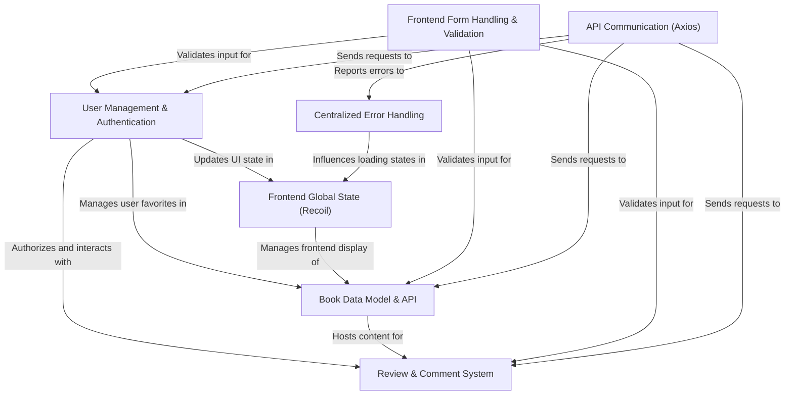

# Tutorial: book-world

The `book-world` project is an interactive online platform designed for **book enthusiasts**.
It allows users to _manage their personal reading experience_ by discovering new books,
adding their own, and leaving **reviews** and comments. The system securely handles
**user authentication** and permissions to create a vibrant community around books.

## Visual Overview

## Chapters

1. [Book Data Model & API
   ](01_book_data_model___api_.md)
2. [User Management & Authentication
   ](02_user_management___authentication_.md)
3. [Review & Comment System
   ](03_review___comment_system_.md)
4. [Frontend Form Handling & Validation
   ](04_frontend_form_handling___validation_.md)
5. [API Communication (Axios)
   ](05_api_communication__axios__.md)
6. [Frontend Global State (Recoil)
   ](06_frontend_global_state__recoil__.md)
7. [Centralized Error Handling
   ](07_centralized_error_handling_.md)

---
